# Coffee themes for Omarchy

[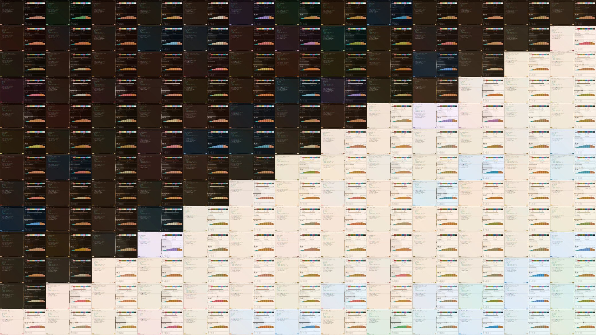](https://bjarneo.github.io/coffee-themes)

This repo has 82 coffee themes for [Omarchy](https://omarchy.org), from espresso to Italian roast. Each theme has a night variant and a day variant. That makes 164 Omarchy themes. Each variant has a 16-color ANSI palette and 5 backgrounds at 6K.

- Site: [bjarneo.github.io/coffee-themes](https://bjarneo.github.io/coffee-themes)
- Promo video: [`site/assets/promo.mp4`](site/assets/promo.mp4), all 82 drinks, one per beat
- Screenshots: real captures of an Omarchy desktop with each variant applied
- Backgrounds: 820 at 6K, 6144×3456

## Variants

| Variant | Theme name | What it is | Lowest ANSI contrast | Lowest text contrast |
| --- | --- | --- | --- | --- |
| Night | `mocha-night` | A dark coffee background with warm colors. For the evening and dim rooms. | 5.6:1 | 12.3:1 |
| Day | `mocha-day` | A cream background with the same hues. For bright rooms and daylight. | 4.5:1 | 11.8:1 |

The contrast columns show the lowest WCAG contrast ratio against the background, over all 82 themes. The script raises or lowers the lightness of each color until it reaches its target. The 6 main ANSI colors reach at least 4.5:1, the WCAG AA level. The muted color for comments reaches at least 3.8:1. Each variant is a complete Omarchy theme with its own folder, so you can install any mix of them.

## Signature palettes

45 drinks use a signature palette. Like Osaka Jade and Miasma in Omarchy, they fill the 6 ANSI slots with the colors of the drink, so a slot can hold a color that is not its name. The yellow of Cold Brew is coffee amber, the blue of Pumpkin Spice Latte is pumpkin, and the roast levels use the browns of their roast. The other drinks keep a classic palette, where red is red and blue is blue.

The contrast targets above apply to both kinds. A check also keeps the 6 slots apart, so no 2 slots look the same.

Signature palettes: [Espresso Solo](#espresso-solo), [Ristretto](#ristretto), [Mocha](#mocha), [White Mocha](#white-mocha), [Romano](#romano), [Affogato](#affogato), [Red Eye](#red-eye), [Black Eye](#black-eye), [Dead Eye](#dead-eye), [Siphon](#siphon), [Percolator](#percolator), [Cold Brew](#cold-brew), [Nitro Cold Brew](#nitro-cold-brew), [Turkish Coffee](#turkish-coffee), [Cowboy Coffee](#cowboy-coffee), [Espresso Tonic](#espresso-tonic), [Japanese Iced Coffee](#japanese-iced-coffee), [Greek Frappé](#greek-frappé), [Dalgona Coffee](#dalgona-coffee), [Irish Coffee](#irish-coffee), [Café de Olla](#café-de-olla), [Cà Phê Sữa Đá](#cà-phê-sữa-đá), [Kopi](#kopi), [Yuanyang](#yuanyang), [Galão](#galão), [Wiener Melange](#wiener-melange), [Qahwa](#qahwa), [Bicerin](#bicerin), [Caramel Macchiato](#caramel-macchiato), [Peppermint Mocha](#peppermint-mocha), [Pumpkin Spice Latte](#pumpkin-spice-latte), [Honey Latte](#honey-latte), [Lavender Latte](#lavender-latte), [Dirty Chai](#dirty-chai), [Arabica](#arabica), [Robusta](#robusta), [Liberica](#liberica), [Excelsa](#excelsa), [Cinnamon Roast](#cinnamon-roast), [Light Roast](#light-roast), [City Roast](#city-roast), [Full City Roast](#full-city-roast), [Vienna Roast](#vienna-roast), [French Roast](#french-roast), [Italian Roast](#italian-roast).

## Backgrounds

Each variant has 5 backgrounds. Omarchy shows them in this order. To show the next one, run `omarchy theme bg next`.

| File | What it shows |
| --- | --- |
| `0-omarchy-wordmark.jpg` | The Omarchy wordmark with coffee ring stains. The ANSI colors sit under it as coffee beans. |
| `1-latte-art.jpg` | A top view of the drink on a table: latte art, crema, cream, ice or cocoa dust. |
| `2-recipe.jpg` | A cross-section of the drink with the share of each part. Roast levels show the roast curve. Coffee beans show a coffee cherry. |
| `3-crema-swirl.jpg` | Cream that swirls into coffee, with a thin ribbon of the accent color. |
| `4-coffee-beans.jpg` | Roasted beans in the roast color of the theme. |

## Install

`install.sh` copies themes into `~/.config/omarchy/themes`. Each theme variant becomes a normal Omarchy theme folder. The script installs the night and day variants of a theme unless you name one with `--variant`.

### Install one theme without a clone

The script downloads only the themes that you name:

```bash
curl -fsSL https://bjarneo.github.io/coffee-themes/install.sh | bash -s -- mocha --set
```

To install one variant only, add `--variant`:

```bash
curl -fsSL https://bjarneo.github.io/coffee-themes/install.sh | bash -s -- mocha latte --variant day
```

`--set` applies the first installed variant of the last theme.

### Install from a clone

```bash
git clone --depth 1 https://github.com/bjarneo/coffee-themes ~/.local/share/coffee-themes
cd ~/.local/share/coffee-themes
./install.sh --all
omarchy theme set mocha-night
```

The full repo is about 1190 MB because it has 820 backgrounds at 6K. To download less, use the `curl` command above. It downloads only the folders that you name.

### Options

| Command | Result |
| --- | --- |
| `install.sh mocha latte` | Installs the night and day variants of the named themes |
| `install.sh mocha --variant day` | Installs only this variant |
| `install.sh --all` | Installs all 164 themes |
| `install.sh --list` | Lists the 82 theme names |
| `install.sh mocha --set` | Installs the theme, then applies its night variant |
| `install.sh --update` | Installs again every theme variant that the script installed |
| `install.sh --remove mocha` | Removes the variants of a theme that the script installed |
| `install.sh --link mocha` | Links to the clone instead of copying. Run `git pull` in the clone to update. |
| `install.sh --force mocha` | Replaces a theme with the same name that the script did not install |

The variant names are `night` and `day`. The script writes a `.coffee-themes` marker file in each theme that it copies. `--update` and `--remove` use this file, so they never change a theme that you made.

### Apply with Aether

[Aether](https://github.com/omacom/aether) can apply a theme straight from the [site](https://bjarneo.github.io/coffee-themes). Open a drink, pick a variant and a background, and select 1 of these buttons:

| Button | Result |
| --- | --- |
| Apply with Aether | Aether loads the palette and the background, then applies them at once through its own theme. |
| Install as Omarchy theme | Aether adds the variant to `~/.config/omarchy/themes` and activates it at once. This stops if a theme with the same name exists, for example after `install.sh`. |
| Open in editor | Aether opens the palette in its editor. Nothing changes until you select Apply. |

Aether stops a download after 60 seconds. On a slow connection, a 6K background can take longer, so the links download a 3840×2160 copy from `site/assets/aether/`. GitHub does not render `aether://` links, so use the site or build a link yourself:

```text
aether://apply?colors=https://bjarneo.github.io/coffee-themes/mocha/night/colors.toml&wallpaper=https://bjarneo.github.io/coffee-themes/assets/aether/mocha/night/1-latte-art.jpg&silent=true
```

Add `&as_omarchy_theme=mocha-night` to install the variant. Use `&edit=true` instead of `&silent=true` to open the editor.

### Name conflicts

All theme names end in `-night` or `-day`, so they do not collide with the themes that ship with Omarchy. The script does not replace a theme that it did not install. If `~/.config/omarchy/themes/mocha-night` exists, the script skips it and tells you. Rename your theme, or use `--force` to replace it.

The single espresso shot is called Espresso Solo. Its names are `espresso-solo-night` and `espresso-solo-day`, so they do not collide with `espresso-day` from [100-themes](https://github.com/bjarneo/100-themes).

`omarchy theme install <url>` does not work with this repo. That command expects one theme at the root of a repo.

## Switch themes and backgrounds

```bash
omarchy theme set mocha-night   # apply a theme
omarchy theme set mocha-day     # the same drink in daylight
omarchy theme bg next           # show the next background of the current theme
```

## The menu

| Category | Drinks |
| --- | --- |
| Espresso drinks | [Espresso Solo](#espresso-solo), [Doppio](#doppio), [Ristretto](#ristretto), [Lungo](#lungo), [Americano](#americano), [Long Black](#long-black), [Macchiato](#macchiato), [Cortado](#cortado), [Gibraltar](#gibraltar), [Piccolo](#piccolo), [Flat White](#flat-white), [Cappuccino](#cappuccino), [Latte](#latte), [Latte Macchiato](#latte-macchiato), [Mocha](#mocha), [White Mocha](#white-mocha), [Breve](#breve), [Con Panna](#con-panna), [Romano](#romano), [Affogato](#affogato), [Marocchino](#marocchino), [Corretto](#corretto), [Red Eye](#red-eye), [Black Eye](#black-eye), [Dead Eye](#dead-eye) |
| Brewing methods | [Drip Coffee](#drip-coffee), [Pour-Over](#pour-over), [French Press](#french-press), [AeroPress](#aeropress), [Chemex](#chemex), [Siphon](#siphon), [Moka Pot](#moka-pot), [Percolator](#percolator), [Cold Brew](#cold-brew), [Nitro Cold Brew](#nitro-cold-brew), [Turkish Coffee](#turkish-coffee), [Cowboy Coffee](#cowboy-coffee) |
| Iced and cold drinks | [Iced Coffee](#iced-coffee), [Iced Latte](#iced-latte), [Shakerato](#shakerato), [Espresso Tonic](#espresso-tonic), [Japanese Iced Coffee](#japanese-iced-coffee), [Greek Frappé](#greek-frappé), [Dalgona Coffee](#dalgona-coffee), [Mazagran](#mazagran) |
| Regional drinks | [Irish Coffee](#irish-coffee), [Café au Lait](#café-au-lait), [Café Cubano](#café-cubano), [Cortadito](#cortadito), [Café Bombón](#café-bombón), [Carajillo](#carajillo), [Café de Olla](#café-de-olla), [Cà Phê Sữa Đá](#cà-phê-sữa-đá), [Cà Phê Trứng](#cà-phê-trứng), [Kopi](#kopi), [Yuanyang](#yuanyang), [Galão](#galão), [Wiener Melange](#wiener-melange), [Einspänner](#einspänner), [Pharisäer](#pharisäer), [Kaffeost](#kaffeost), [Qahwa](#qahwa), [Bicerin](#bicerin) |
| Flavored drinks | [Caramel Macchiato](#caramel-macchiato), [Vanilla Latte](#vanilla-latte), [Hazelnut Latte](#hazelnut-latte), [Peppermint Mocha](#peppermint-mocha), [Pumpkin Spice Latte](#pumpkin-spice-latte), [Honey Latte](#honey-latte), [Lavender Latte](#lavender-latte), [Dirty Chai](#dirty-chai) |
| Coffee beans | [Arabica](#arabica), [Robusta](#robusta), [Liberica](#liberica), [Excelsa](#excelsa) |
| Roast levels | [Cinnamon Roast](#cinnamon-roast), [Light Roast](#light-roast), [City Roast](#city-roast), [Full City Roast](#full-city-roast), [Vienna Roast](#vienna-roast), [French Roast](#french-roast), [Italian Roast](#italian-roast) |

## Espresso drinks

### Espresso Solo

[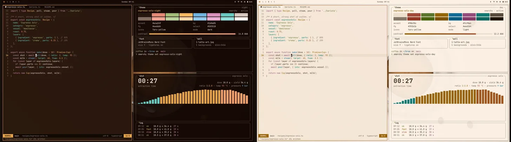](https://bjarneo.github.io/coffee-themes/#espresso-solo)

`01` · Signature palette · Folder: [`espresso-solo/`](espresso-solo/) · [Open on the site](https://bjarneo.github.io/coffee-themes/#espresso-solo)

A short, strong shot of coffee. The recipe background shows the recipe.

| Variant | Theme name | `background` | `foreground` | `accent` | Icons |
| --- | --- | --- | --- | --- | --- |
| Night | [`espresso-solo-night`](espresso-solo/night/) | `#160a05` | `#eeddd4` | `#e4a249` | `Yaru-yellow` |
| Day | [`espresso-solo-day`](espresso-solo/day/) | `#fcf0e4` | `#392b1b` | `#98630c` | `Yaru-yellow` |

<details>
<summary>All 16 ANSI colors of each variant</summary>

| Variant | Normal, 0 to 7 | Bright, 8 to 15 |
| --- | --- | --- |
| Night | `#261810` `#dd7767` `#c1c37e` `#fec766` `#cea081` `#e299a9` `#9fcfcb` `#d8c6bd` | `#836c60` `#ea9486` `#d6d9a1` `#fee4ba` `#dfb89e` `#f2b4c0` `#bde4e0` `#fdf5f1` |
| Day | `#eeddcc` `#983124` `#717227` `#7c5700` `#724627` `#944d5f` `#457774` `#594a3b` | `#877767` `#86190f` `#5d5e02` `#664804` `#613513` `#833b4e` `#2f6360` `#1f1308` |

</details>

```bash
curl -fsSL https://bjarneo.github.io/coffee-themes/install.sh | bash -s -- espresso-solo --set
```

### Doppio

[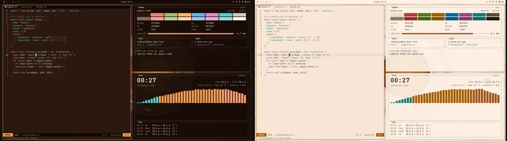](https://bjarneo.github.io/coffee-themes/#doppio)

`02` · Folder: [`doppio/`](doppio/) · [Open on the site](https://bjarneo.github.io/coffee-themes/#doppio)

A double shot of espresso. The recipe background shows the recipe.

| Variant | Theme name | `background` | `foreground` | `accent` | Icons |
| --- | --- | --- | --- | --- | --- |
| Night | [`doppio-night`](doppio/night/) | `#170b06` | `#f0ddd5` | `#f19a4b` | `Yaru` |
| Day | [`doppio-day`](doppio/day/) | `#fef0e3` | `#3a2a1a` | `#a75c00` | `Yaru` |

<details>
<summary>All 16 ANSI colors of each variant</summary>

| Variant | Normal, 0 to 7 | Bright, 8 to 15 |
| --- | --- | --- |
| Night | `#281912` `#ec8279` `#9dbf6f` `#feb763` `#68b3e9` `#df8bbf` `#52cdcb` `#dac6bd` | `#846b61` `#f99f97` `#b7d392` `#fdd6ad` `#8cc8f5` `#eea7d2` `#84e0de` `#fdf5f1` |
| Day | `#f0ddcb` `#ac403b` `#58781e` `#9b6109` `#016a9f` `#9a467d` `#127b7a` `#5a4a3b` | `#887767` `#9a2a29` `#466500` `#825107` `#055885` `#88336c` `#0c6665` `#1f1307` |

</details>

```bash
curl -fsSL https://bjarneo.github.io/coffee-themes/install.sh | bash -s -- doppio --set
```

### Ristretto

[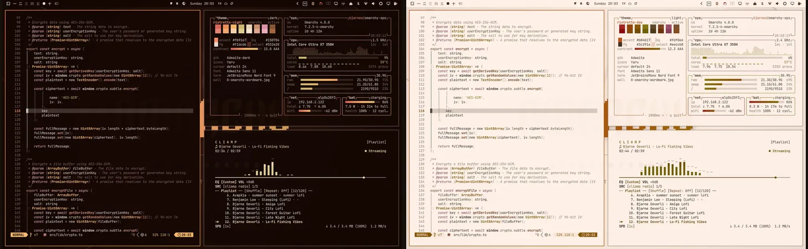](https://bjarneo.github.io/coffee-themes/#ristretto)

`03` · Signature palette · Folder: [`ristretto/`](ristretto/) · [Open on the site](https://bjarneo.github.io/coffee-themes/#ristretto)

A short pull with less water. It tastes sweeter and stronger. The recipe background shows the recipe.

| Variant | Theme name | `background` | `foreground` | `accent` | Icons |
| --- | --- | --- | --- | --- | --- |
| Night | [`ristretto-night`](ristretto/night/) | `#150704` | `#f1dcd6` | `#fb9167` | `Yaru` |
| Day | [`ristretto-day`](ristretto/day/) | `#fdf0e6` | `#3c291a` | `#b84b17` | `Yaru` |

<details>
<summary>All 16 ANSI colors of each variant</summary>

| Variant | Normal, 0 to 7 | Bright, 8 to 15 |
| --- | --- | --- |
| Night | `#26140f` `#df695c` `#d2bd70` `#ffbc6a` `#d49375` `#e696ae` `#f2daba` `#dbc5be` | `#866a62` `#eb887c` `#e5d496` `#fedbb3` `#e4ac94` `#f5b1c5` `#fdecd4` `#fdf5f2` |
| Day | `#f2dcca` `#9c1e1a` `#816c07` `#845200` `#793b1c` `#974964` `#574223` `#5b493a` | `#8a7666` `#860307` `#6c5a00` `#6d4400` `#682904` `#853753` `#473211` `#201307` |

</details>

```bash
curl -fsSL https://bjarneo.github.io/coffee-themes/install.sh | bash -s -- ristretto --set
```

### Lungo

[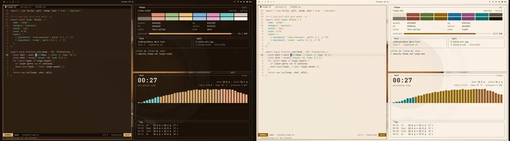](https://bjarneo.github.io/coffee-themes/#lungo)

`04` · Folder: [`lungo/`](lungo/) · [Open on the site](https://bjarneo.github.io/coffee-themes/#lungo)

A long pull with more water. The recipe background shows the recipe.

| Variant | Theme name | `background` | `foreground` | `accent` | Icons |
| --- | --- | --- | --- | --- | --- |
| Night | [`lungo-night`](lungo/night/) | `#1b1109` | `#edded3` | `#d4a965` | `Yaru-yellow` |
| Day | [`lungo-day`](lungo/day/) | `#fbf1e5` | `#382b1b` | `#916508` | `Yaru-yellow` |

<details>
<summary>All 16 ANSI colors of each variant</summary>

| Variant | Normal, 0 to 7 | Bright, 8 to 15 |
| --- | --- | --- |
| Night | `#2c2017` `#dc8d7b` `#a0bc80` `#e9c17a` `#77b3db` `#d593b9` `#71c9c6` `#d7c7bc` | `#826f60` `#eaa898` `#b9d19f` `#fbd9a0` `#98c8ea` `#e5aecd` `#97ddda` `#fcf5f0` |
| Day | `#ecdecd` `#9d4f3e` `#5b7638` `#90680f` `#276a92` `#905077` `#127b7a` `#574b3b` | `#857867` `#8b3c2b` `#496321` `#785503` `#0a5981` `#7f3e66` `#006766` `#1e1408` |

</details>

```bash
curl -fsSL https://bjarneo.github.io/coffee-themes/install.sh | bash -s -- lungo --set
```

### Americano

[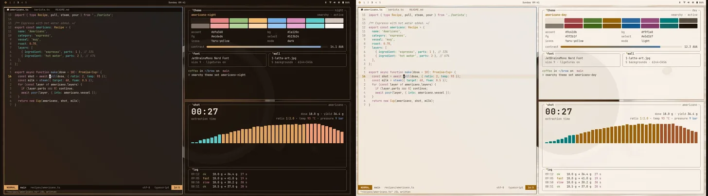](https://bjarneo.github.io/coffee-themes/#americano)

`05` · Folder: [`americano/`](americano/) · [Open on the site](https://bjarneo.github.io/coffee-themes/#americano)

Espresso with hot water added. The recipe background shows the recipe.

| Variant | Theme name | `background` | `foreground` | `accent` | Icons |
| --- | --- | --- | --- | --- | --- |
| Night | [`americano-night`](americano/night/) | `#1a120c` | `#ecded6` | `#dfa360` | `Yaru-yellow` |
| Day | [`americano-day`](americano/day/) | `#f9f1e8` | `#372b1f` | `#9c610b` | `Yaru-yellow` |

<details>
<summary>All 16 ANSI colors of each variant</summary>

| Variant | Normal, 0 to 7 | Bright, 8 to 15 |
| --- | --- | --- |
| Night | `#2a201a` `#e48682` `#98bf7a` `#f6bb6f` `#77b0e9` `#da8fbf` `#5bcccb` `#d6c7be` | `#806f64` `#f1a29e` `#b2d39a` `#fed7a8` `#97c6f5` `#eaaad2` `#89dfdf` `#fcf5f1` |
| Day | `#eaded1` `#a54746` `#52792f` `#996306` `#29669f` `#954b7c` `#007a7a` `#564b3e` | `#84786a` `#933335` `#3f6616` `#7f5105` `#0f558e` `#84386b` `#0f6565` `#1d140a` |

</details>

```bash
curl -fsSL https://bjarneo.github.io/coffee-themes/install.sh | bash -s -- americano --set
```

### Long Black

[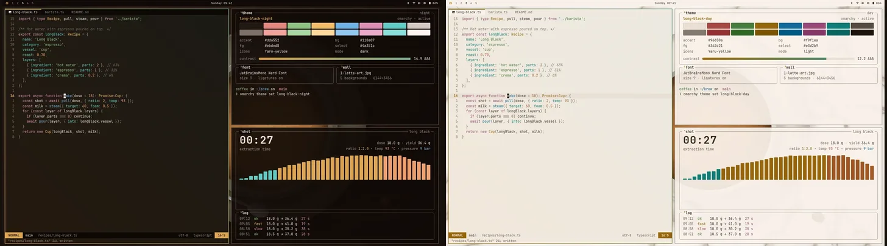](https://bjarneo.github.io/coffee-themes/#long-black)

`06` · Folder: [`long-black/`](long-black/) · [Open on the site](https://bjarneo.github.io/coffee-themes/#long-black)

Hot water with espresso poured on top. The recipe background shows the recipe.

| Variant | Theme name | `background` | `foreground` | `accent` | Icons |
| --- | --- | --- | --- | --- | --- |
| Night | [`long-black-night`](long-black/night/) | `#110a07` | `#ebded8` | `#dda552` | `Yaru-yellow` |
| Day | [`long-black-day`](long-black/day/) | `#f9f1ea` | `#362c21` | `#96650a` | `Yaru-yellow` |

<details>
<summary>All 16 ANSI colors of each variant</summary>

| Variant | Normal, 0 to 7 | Bright, 8 to 15 |
| --- | --- | --- |
| Night | `#211814` `#e48780` `#8dc283` `#f1be67` `#6db3e4` `#dc8eb9` `#5fccc6` `#d5c7c0` | `#7e6e65` `#f2a39c` `#aad6a2` `#fed89b` `#90c8f1` `#ebaacc` `#8bdfda` `#fdf5f1` |
| Day | `#e9ded4` `#a54743` `#457b3b` `#92670c` `#136a9a` `#974a77` `#0e7c78` `#564b40` | `#84786c` `#933331` `#2f6724` `#7a5400` `#005885` `#853766` `#086662` `#1d140c` |

</details>

```bash
curl -fsSL https://bjarneo.github.io/coffee-themes/install.sh | bash -s -- long-black --set
```

### Macchiato

[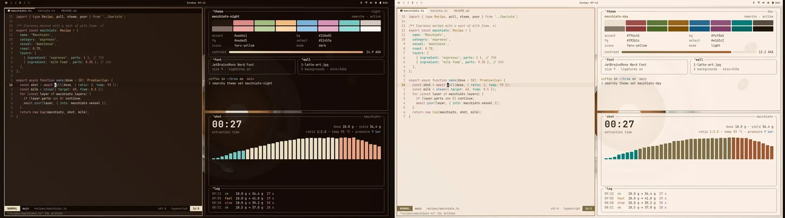](https://bjarneo.github.io/coffee-themes/#macchiato)

`07` · Folder: [`macchiato/`](macchiato/) · [Open on the site](https://bjarneo.github.io/coffee-themes/#macchiato)

Espresso marked with a spot of milk foam. The recipe background shows the recipe.

| Variant | Theme name | `background` | `foreground` | `accent` | Icons |
| --- | --- | --- | --- | --- | --- |
| Night | [`macchiato-night`](macchiato/night/) | `#150a05` | `#eeded5` | `#eaddc1` | `Yaru-yellow` |
| Day | [`macchiato-day`](macchiato/day/) | `#fcf0e5` | `#392b1c` | `#7f6c45` | `Yaru-yellow` |

<details>
<summary>All 16 ANSI colors of each variant</summary>

| Variant | Normal, 0 to 7 | Bright, 8 to 15 |
| --- | --- | --- |
| Night | `#251811` `#dc8b87` `#a2bc80` `#f2bc7f` `#78b2da` `#d693b7` `#74c9c3` `#d8c7bd` | `#826c61` `#eba6a1` `#bbd19f` `#fed6ab` `#98c7e9` `#e6aecb` `#99ddd8` `#fdf5f1` |
| Day | `#edddce` `#9e4d4a` `#5d7637` `#98631b` `#2a6a91` `#915075` `#077c77` `#584a3c` | `#877768` `#8c3a39` `#4b6322` `#815004` `#0f5981` `#803e64` `#036661` `#1e1408` |

</details>

```bash
curl -fsSL https://bjarneo.github.io/coffee-themes/install.sh | bash -s -- macchiato --set
```

### Cortado

[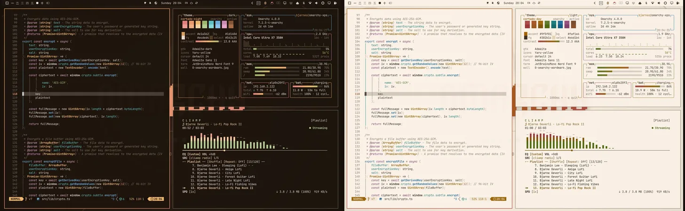](https://bjarneo.github.io/coffee-themes/#cortado)

`08` · Folder: [`cortado/`](cortado/) · [Open on the site](https://bjarneo.github.io/coffee-themes/#cortado)

Espresso cut with an equal amount of warm milk. The recipe background shows the recipe.

| Variant | Theme name | `background` | `foreground` | `accent` | Icons |
| --- | --- | --- | --- | --- | --- |
| Night | [`cortado-night`](cortado/night/) | `#1d140d` | `#ecded4` | `#e1a362` | `Yaru-yellow` |
| Day | [`cortado-day`](cortado/day/) | `#faf1e6` | `#382b1c` | `#9f5f01` | `Yaru-yellow` |

<details>
<summary>All 16 ANSI colors of each variant</summary>

| Variant | Normal, 0 to 7 | Bright, 8 to 15 |
| --- | --- | --- |
| Night | `#2e231a` `#e6857f` `#a1bd75` `#f6bb6f` `#70b3e4` `#d98fbe` `#60cbcc` `#d6c7bd` | `#837063` `#f3a29b` `#bad297` `#fed7a8` `#92c8f1` `#e9aad1` `#8cdfdf` `#fcf5f0` |
| Day | `#ebdece` `#a74542` `#5c7728` `#996304` `#1b699a` `#954b7c` `#127b7c` `#574b3c` | `#857868` `#953130` `#4a640a` `#7e5104` `#085884` `#83396b` `#0e6667` `#1d1409` |

</details>

```bash
curl -fsSL https://bjarneo.github.io/coffee-themes/install.sh | bash -s -- cortado --set
```

### Gibraltar

[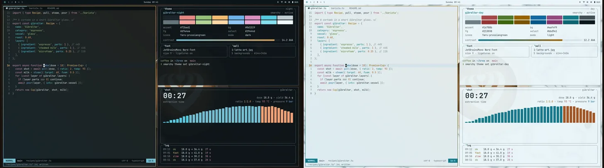](https://bjarneo.github.io/coffee-themes/#gibraltar)

`09` · Folder: [`gibraltar/`](gibraltar/) · [Open on the site](https://bjarneo.github.io/coffee-themes/#gibraltar)

A cortado in a short Gibraltar glass. The recipe background shows the recipe.

| Variant | Theme name | `background` | `foreground` | `accent` | Icons |
| --- | --- | --- | --- | --- | --- |
| Night | [`gibraltar-night`](gibraltar/night/) | `#0d1519` | `#d7e4ea` | `#72bed1` | `Yaru-prussiangreen` |
| Day | [`gibraltar-day`](gibraltar/day/) | `#eaf4f9` | `#213038` | `#16788b` | `Yaru-prussiangreen` |

<details>
<summary>All 16 ANSI colors of each variant</summary>

| Variant | Normal, 0 to 7 | Bright, 8 to 15 |
| --- | --- | --- |
| Night | `#1b2429` `#e48682` `#96c076` `#f4bc6e` `#6cb2eb` `#da8ec1` `#52cade` `#bfcdd4` | `#64757d` `#f1a29e` `#b1d497` `#ffd7a3` `#8fc8f7` `#eaaad4` `#83deee` `#f0f8fc` |
| Day | `#d5e3ea` `#a54746` `#507a2a` `#976401` `#1168a1` `#954a7f` `#127988` `#415057` | `#6d7d85` `#933334` `#3b660b` `#7d5202` `#045789` `#84376e` `#0c6571` `#0c181e` |

</details>

```bash
curl -fsSL https://bjarneo.github.io/coffee-themes/install.sh | bash -s -- gibraltar --set
```

### Piccolo

[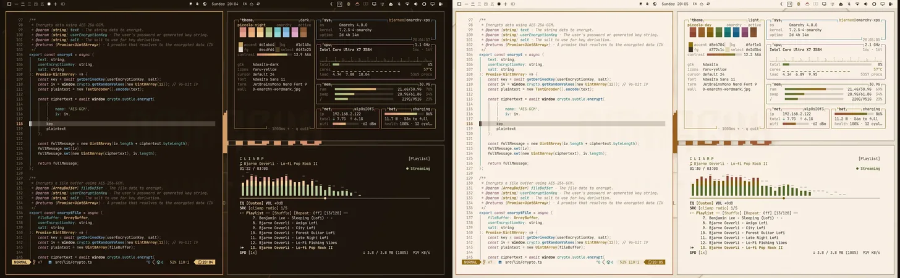](https://bjarneo.github.io/coffee-themes/#piccolo)

`10` · Folder: [`piccolo/`](piccolo/) · [Open on the site](https://bjarneo.github.io/coffee-themes/#piccolo)

A ristretto with warm milk in a small glass. The recipe background shows the recipe.

| Variant | Theme name | `background` | `foreground` | `accent` | Icons |
| --- | --- | --- | --- | --- | --- |
| Night | [`piccolo-night`](piccolo/night/) | `#1d140c` | `#ecdfd4` | `#d1ab64` | `Yaru-yellow` |
| Day | [`piccolo-day`](piccolo/day/) | `#faf1e5` | `#372c1c` | `#8e6704` | `Yaru-yellow` |

<details>
<summary>All 16 ANSI colors of each variant</summary>

| Variant | Normal, 0 to 7 | Bright, 8 to 15 |
| --- | --- | --- |
| Night | `#2d231a` `#dc8d7a` `#a2bc7f` `#e9c17a` `#77b3db` `#d693b8` `#71c9c7` `#d6c8bc` | `#827162` `#eaa897` `#bbd19e` `#fbd9a0` `#97c8ea` `#e6aecc` `#97dddb` `#fcf5f0` |
| Day | `#ebdece` `#9d4f3d` `#5d7636` `#90680f` `#276a92` `#915076` `#127b7a` `#574b3c` | `#857868` `#8b3d2a` `#4b6320` `#785503` `#095981` `#803e65` `#0d6564` `#1d1408` |

</details>

```bash
curl -fsSL https://bjarneo.github.io/coffee-themes/install.sh | bash -s -- piccolo --set
```

### Flat White

[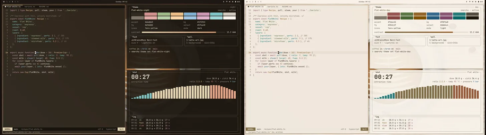](https://bjarneo.github.io/coffee-themes/#flat-white)

`11` · Folder: [`flat-white/`](flat-white/) · [Open on the site](https://bjarneo.github.io/coffee-themes/#flat-white)

Espresso with thin, velvety microfoam. The recipe background shows the recipe.

| Variant | Theme name | `background` | `foreground` | `accent` | Icons |
| --- | --- | --- | --- | --- | --- |
| Night | [`flat-white-night`](flat-white/night/) | `#1f1913` | `#e9e0d5` | `#e6d6b3` | `Yaru-yellow` |
| Day | [`flat-white-day`](flat-white/day/) | `#f8f1e8` | `#352c1f` | `#7e6c45` | `Yaru-yellow` |

<details>
<summary>All 16 ANSI colors of each variant</summary>

| Variant | Normal, 0 to 7 | Bright, 8 to 15 |
| --- | --- | --- |
| Night | `#302921` `#d4908c` `#9fbc8b` `#edbe86` `#81b1d5` `#d8a0c1` `#7ec6c6` `#d3c9bd` | `#807466` `#e4aaa6` `#b8d1a8` `#fed7a9` `#9fc6e4` `#e9bad5` `#a0dada` `#fbf6f0` |
| Day | `#e8dfd2` `#965350` `#597644` `#936527` `#36698c` `#8b5576` `#257a7a` `#554c3f` | `#82796b` `#85413f` `#476331` `#7f5003` `#22587b` `#7a4365` `#086566` `#1c150a` |

</details>

```bash
curl -fsSL https://bjarneo.github.io/coffee-themes/install.sh | bash -s -- flat-white --set
```

### Cappuccino

[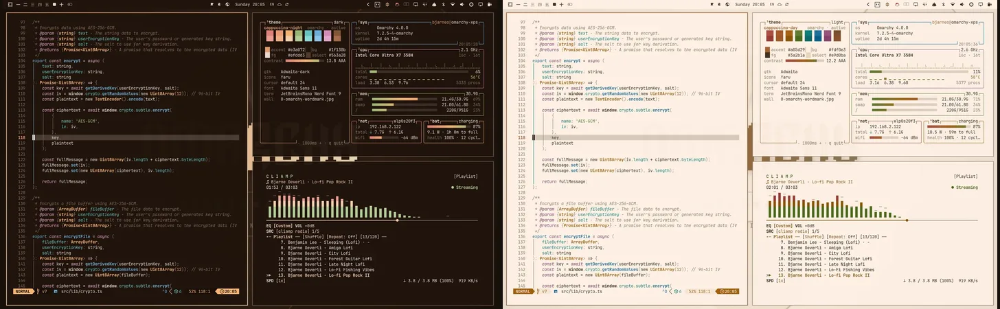](https://bjarneo.github.io/coffee-themes/#cappuccino)

`12` · Folder: [`cappuccino/`](cappuccino/) · [Open on the site](https://bjarneo.github.io/coffee-themes/#cappuccino)

Espresso with equal parts steamed milk and foam. The recipe background shows the recipe.

| Variant | Theme name | `background` | `foreground` | `accent` | Icons |
| --- | --- | --- | --- | --- | --- |
| Night | [`cappuccino-night`](cappuccino/night/) | `#1f130b` | `#efddd3` | `#e3a072` | `Yaru` |
| Day | [`cappuccino-day`](cappuccino/day/) | `#fdf0e3` | `#3a2b1a` | `#a05d29` | `Yaru` |

<details>
<summary>All 16 ANSI colors of each variant</summary>

| Variant | Normal, 0 to 7 | Bright, 8 to 15 |
| --- | --- | --- |
| Night | `#302118` `#e4877b` `#9dbe79` `#fcb774` `#6eb4e1` `#d990be` `#63cbc7` `#d9c6bc` | `#856e60` `#f1a398` `#b6d39a` `#fdd6b2` `#91c9ef` `#e9abd1` `#8edfdb` `#fdf5f1` |
| Day | `#efddcb` `#a5483d` `#57782e` `#a05e09` `#156a98` `#944c7c` `#037a78` `#594a3a` | `#877766` `#93342b` `#436413` `#874e00` `#005982` `#83396b` `#016563` `#1f1307` |

</details>

```bash
curl -fsSL https://bjarneo.github.io/coffee-themes/install.sh | bash -s -- cappuccino --set
```

### Latte

[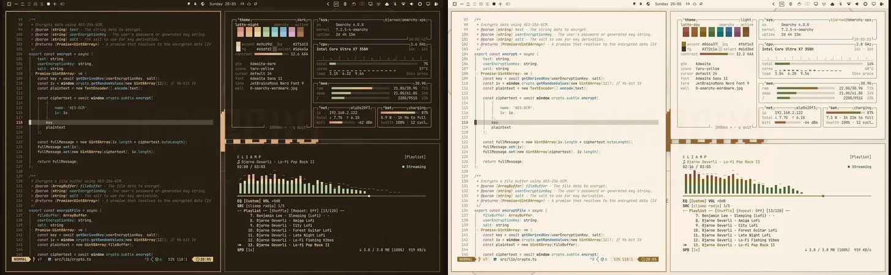](https://bjarneo.github.io/coffee-themes/#latte)

`13` · Folder: [`latte/`](latte/) · [Open on the site](https://bjarneo.github.io/coffee-themes/#latte)

Espresso with a lot of steamed milk and a thin layer of foam. The recipe background shows the recipe.

| Variant | Theme name | `background` | `foreground` | `accent` | Icons |
| --- | --- | --- | --- | --- | --- |
| Night | [`latte-night`](latte/night/) | `#271d13` | `#ebdfd2` | `#e9cd9d` | `Yaru-yellow` |
| Day | [`latte-day`](latte/day/) | `#fbf1e3` | `#372c1a` | `#866a37` | `Yaru-yellow` |

<details>
<summary>All 16 ANSI colors of each variant</summary>

| Variant | Normal, 0 to 7 | Bright, 8 to 15 |
| --- | --- | --- |
| Night | `#382d21` `#d79080` `#9fbc8b` `#e3c288` `#80b2d4` `#cf97b7` `#7ec6c5` `#d5c8ba` | `#887765` `#e6aa9c` `#b9d1a8` `#f5daaa` `#9ec7e4` `#e0b1cb` `#a0dad9` `#fbf6f0` |
| Day | `#ebdecb` `#995243` `#5b7745` `#896929` `#34698b` `#8b5575` `#257a79` `#574b3a` | `#857866` `#874031` `#476330` `#77560a` `#1f587a` `#7a4364` `#086565` `#1d1407` |

</details>

```bash
curl -fsSL https://bjarneo.github.io/coffee-themes/install.sh | bash -s -- latte --set
```

### Latte Macchiato

[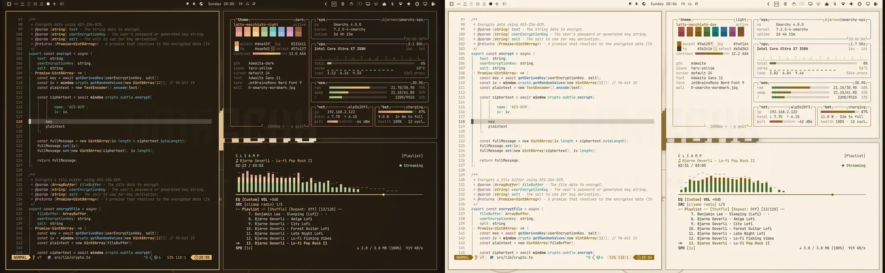](https://bjarneo.github.io/coffee-themes/#latte-macchiato)

`14` · Folder: [`latte-macchiato/`](latte-macchiato/) · [Open on the site](https://bjarneo.github.io/coffee-themes/#latte-macchiato)

Steamed milk with espresso poured on top. The recipe background shows the recipe.

| Variant | Theme name | `background` | `foreground` | `accent` | Icons |
| --- | --- | --- | --- | --- | --- |
| Night | [`latte-macchiato-night`](latte-macchiato/night/) | `#231b11` | `#eae0d2` | `#dea45f` | `Yaru-yellow` |
| Day | [`latte-macchiato-day`](latte-macchiato/day/) | `#faf1e4` | `#362c1b` | `#9a6207` | `Yaru-yellow` |

<details>
<summary>All 16 ANSI colors of each variant</summary>

| Variant | Normal, 0 to 7 | Bright, 8 to 15 |
| --- | --- | --- |
| Night | `#342b1f` `#dc8b87` `#9cbd82` `#efbe72` `#77b2dc` `#d593ba` `#6fc9c7` `#d4c9ba` | `#847664` `#eba6a2` `#b6d2a1` `#fed79e` `#97c7ea` `#e5aece` `#96dddb` `#fbf6f0` |
| Day | `#eadfcc` `#9e4d4b` `#57773a` `#936400` `#276993` `#905078` `#077a79` `#564c3b` | `#847967` `#8c3a3a` `#426323` `#7a5302` `#095882` `#7f3e67` `#076564` `#1c1507` |

</details>

```bash
curl -fsSL https://bjarneo.github.io/coffee-themes/install.sh | bash -s -- latte-macchiato --set
```

### Mocha

[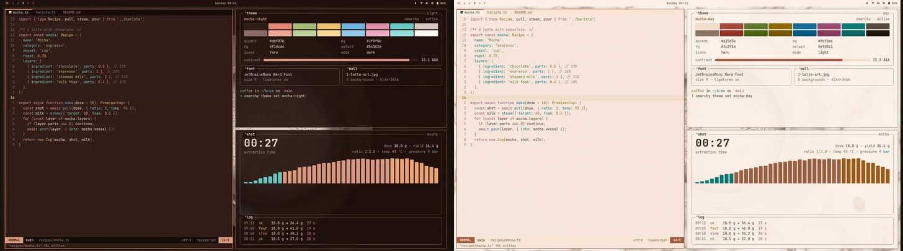](https://bjarneo.github.io/coffee-themes/#mocha)

`15` · Signature palette · Folder: [`mocha/`](mocha/) · [Open on the site](https://bjarneo.github.io/coffee-themes/#mocha)

A latte with chocolate. The recipe background shows the recipe.

| Variant | Theme name | `background` | `foreground` | `accent` | Icons |
| --- | --- | --- | --- | --- | --- |
| Night | [`mocha-night`](mocha/night/) | `#1f0f0b` | `#f1dcd6` | `#db997b` | `Yaru` |
| Day | [`mocha-day`](mocha/day/) | `#fdf0e6` | `#3c291a` | `#a15d3e` | `Yaru` |

<details>
<summary>All 16 ANSI colors of each variant</summary>

| Variant | Normal, 0 to 7 | Bright, 8 to 15 |
| --- | --- | --- |
| Night | `#301d19` `#e07081` `#acc188` `#fdbc6f` `#cf957b` `#e89dc0` `#ecdcc1` `#dbc5bf` | `#886b64` `#ed8e9a` `#c4d6a7` `#fddbb4` `#dfae98` `#f8b8d5` `#faedd6` `#fdf5f2` |
| Day | `#f2dcca` `#9b2742` `#5f7339` `#9a620b` `#884f35` `#974e73` `#7c6d52` `#5b493a` | `#8a7666` `#890732` `#4e6225` `#825100` `#773d22` `#863b62` `#69593e` `#201308` |

</details>

```bash
curl -fsSL https://bjarneo.github.io/coffee-themes/install.sh | bash -s -- mocha --set
```

### White Mocha

[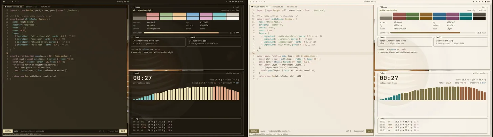](https://bjarneo.github.io/coffee-themes/#white-mocha)

`16` · Signature palette · Folder: [`white-mocha/`](white-mocha/) · [Open on the site](https://bjarneo.github.io/coffee-themes/#white-mocha)

A latte with white chocolate. The recipe background shows the recipe.

| Variant | Theme name | `background` | `foreground` | `accent` | Icons |
| --- | --- | --- | --- | --- | --- |
| Night | [`white-mocha-night`](white-mocha/night/) | `#1f1a11` | `#e9e0d4` | `#ecdeb1` | `Yaru-yellow` |
| Day | [`white-mocha-day`](white-mocha/day/) | `#f8f2e7` | `#352c1e` | `#7c6e40` | `Yaru-yellow` |

<details>
<summary>All 16 ANSI colors of each variant</summary>

| Variant | Normal, 0 to 7 | Bright, 8 to 15 |
| --- | --- | --- |
| Night | `#30291f` `#dc8c7f` `#bcc490` `#f8dc90` `#c8ab90` `#e7acb3` `#b3d9db` `#d3c9bc` | `#817566` `#eaa79b` `#d3daaf` `#ffedc0` `#dbc2ac` `#f8c6cc` `#cfeff0` `#fbf6f0` |
| Day | `#e8dfd1` `#93453a` `#6c733e` `#735b01` `#7d6045` `#945b63` `#4e7476` `#544c3e` | `#82796a` `#813228` `#5a6029` `#604b00` `#6b4f34` `#824953` `#3a6264` `#1c150a` |

</details>

```bash
curl -fsSL https://bjarneo.github.io/coffee-themes/install.sh | bash -s -- white-mocha --set
```

### Breve

[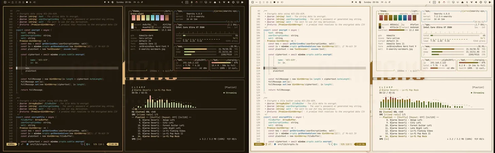](https://bjarneo.github.io/coffee-themes/#breve)

`17` · Folder: [`breve/`](breve/) · [Open on the site](https://bjarneo.github.io/coffee-themes/#breve)

A latte made with half-and-half. The recipe background shows the recipe.

| Variant | Theme name | `background` | `foreground` | `accent` | Icons |
| --- | --- | --- | --- | --- | --- |
| Night | [`breve-night`](breve/night/) | `#1f170d` | `#eadfd2` | `#e8cf8c` | `Yaru-yellow` |
| Day | [`breve-day`](breve/day/) | `#faf1e4` | `#372c1b` | `#856b1c` | `Yaru-yellow` |

<details>
<summary>All 16 ANSI colors of each variant</summary>

| Variant | Normal, 0 to 7 | Bright, 8 to 15 |
| --- | --- | --- |
| Night | `#2f261a` `#dc8c80` `#a3bc7e` `#e4c379` `#7ab2dc` `#d693b7` `#71c9c7` `#d4c8ba` | `#817260` `#eaa79c` `#bcd19e` `#f6db9f` `#9ac7eb` `#e6aecb` `#97dddb` `#fbf6f0` |
| Day | `#eadfcd` `#9e4e43` `#5e7535` `#8a6908` `#2c6993` `#915075` `#127b7a` `#564b3b` | `#847967` `#8c3b31` `#4b621e` `#745700` `#145882` `#803e64` `#0d6564` `#1d1508` |

</details>

```bash
curl -fsSL https://bjarneo.github.io/coffee-themes/install.sh | bash -s -- breve --set
```

### Con Panna

[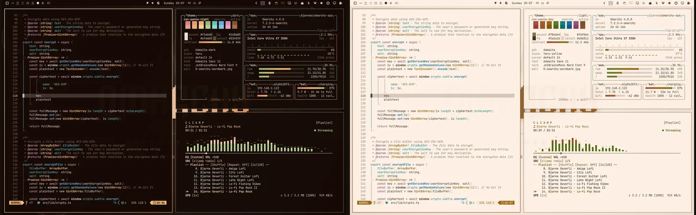](https://bjarneo.github.io/coffee-themes/#con-panna)

`18` · Folder: [`con-panna/`](con-panna/) · [Open on the site](https://bjarneo.github.io/coffee-themes/#con-panna)

Espresso with whipped cream. The recipe background shows the recipe.

| Variant | Theme name | `background` | `foreground` | `accent` | Icons |
| --- | --- | --- | --- | --- | --- |
| Night | [`con-panna-night`](con-panna/night/) | `#160a05` | `#efddd5` | `#f1ebd5` | `Yaru` |
| Day | [`con-panna-day`](con-panna/day/) | `#fdf0e4` | `#3a2a1b` | `#786d44` | `Yaru-yellow` |

<details>
<summary>All 16 ANSI colors of each variant</summary>

| Variant | Normal, 0 to 7 | Bright, 8 to 15 |
| --- | --- | --- |
| Night | `#261811` `#e4877c` `#a2bd76` `#f7ba6f` `#6eb3e2` `#dc8fb8` `#63cbc6` `#d9c6bd` | `#836c61` `#f1a399` `#bbd297` `#fed6a8` `#91c8ef` `#ebaacc` `#8edfda` `#fdf5f1` |
| Day | `#eeddcc` `#a5483f` `#5d7629` `#996307` `#166a98` `#974b76` `#087c78` `#594a3b` | `#877767` `#93342d` `#4a630c` `#7f5106` `#025882` `#853866` `#036663` `#1f1308` |

</details>

```bash
curl -fsSL https://bjarneo.github.io/coffee-themes/install.sh | bash -s -- con-panna --set
```

### Romano

[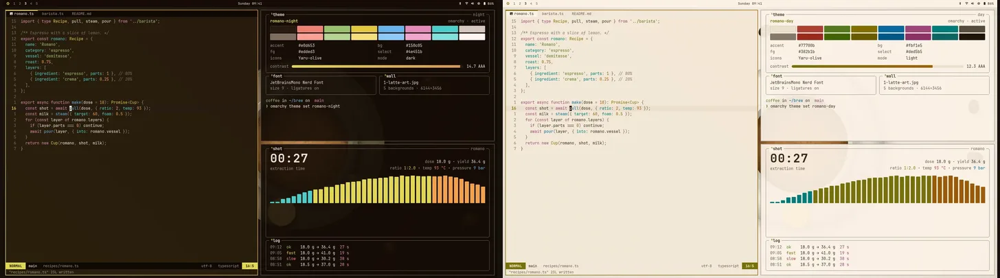](https://bjarneo.github.io/coffee-themes/#romano)

`19` · Signature palette · Folder: [`romano/`](romano/) · [Open on the site](https://bjarneo.github.io/coffee-themes/#romano)

Espresso with a slice of lemon. The recipe background shows the recipe.

| Variant | Theme name | `background` | `foreground` | `accent` | Icons |
| --- | --- | --- | --- | --- | --- |
| Night | [`romano-night`](romano/night/) | `#150c05` | `#edded3` | `#e0d653` | `Yaru-olive` |
| Day | [`romano-day`](romano/day/) | `#fbf1e5` | `#382b1b` | `#77700b` | `Yaru-olive` |

<details>
<summary>All 16 ANSI colors of each variant</summary>

| Variant | Normal, 0 to 7 | Bright, 8 to 15 |
| --- | --- | --- |
| Night | `#261a11` `#dc785f` `#a2ce72` `#eee354` `#cfab6d` `#f5ab78` `#a6daaf` `#d7c7bc` | `#806d5f` `#e9957f` `#bde297` `#fbf487` `#e1c391` `#ffc7a2` `#c3eecb` `#fcf5f0` |
| Day | `#ecdecd` `#973219` `#507b06` `#787003` `#7a5707` `#743800` `#447a51` `#574b3b` | `#857867` `#831e01` `#406500` `#645d02` `#664703` `#5d2c00` `#2f673e` `#1e1408` |

</details>

```bash
curl -fsSL https://bjarneo.github.io/coffee-themes/install.sh | bash -s -- romano --set
```

### Affogato

[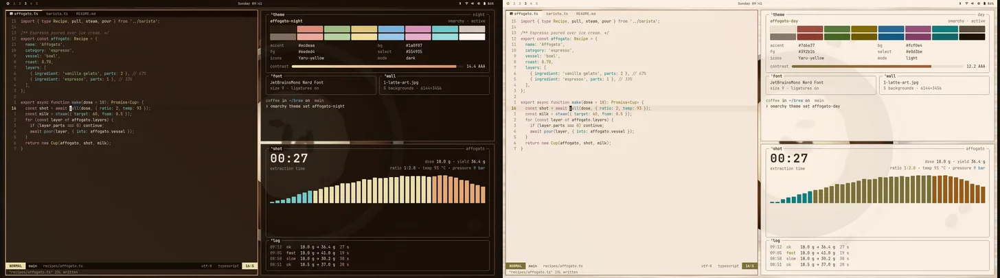](https://bjarneo.github.io/coffee-themes/#affogato)

`20` · Signature palette · Folder: [`affogato/`](affogato/) · [Open on the site](https://bjarneo.github.io/coffee-themes/#affogato)

Espresso poured over ice cream. The recipe background shows the recipe.

| Variant | Theme name | `background` | `foreground` | `accent` | Icons |
| --- | --- | --- | --- | --- | --- |
| Night | [`affogato-night`](affogato/night/) | `#1a0f07` | `#eeded4` | `#ecdeaa` | `Yaru-yellow` |
| Day | [`affogato-day`](affogato/day/) | `#fcf0e4` | `#392b1b` | `#7d6e37` | `Yaru-yellow` |

<details>
<summary>All 16 ANSI colors of each variant</summary>

| Variant | Normal, 0 to 7 | Bright, 8 to 15 |
| --- | --- | --- |
| Night | `#2a1d14` `#da8375` `#adc08f` `#f6dd90` `#c9a187` `#e4a2b0` `#b3d9db` `#d8c7bc` | `#826d5f` `#e89e92` `#c5d5ac` `#feeebc` `#dbb9a3` `#f4bcc8` `#cfeff0` `#fcf5f1` |
| Day | `#edddcc` `#943e32` `#607240` `#846b05` `#80593f` `#945463` `#4e7476` `#584a3b` | `#877767` `#822a20` `#4f612d` `#6f5900` `#6f482d` `#824252` `#3a6264` `#1e1407` |

</details>

```bash
curl -fsSL https://bjarneo.github.io/coffee-themes/install.sh | bash -s -- affogato --set
```

### Marocchino

[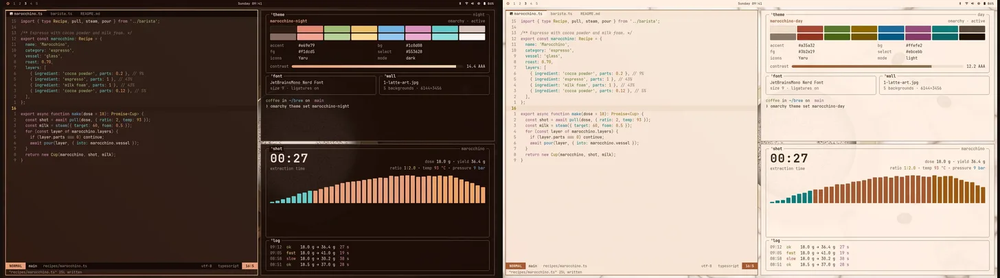](https://bjarneo.github.io/coffee-themes/#marocchino)

`21` · Folder: [`marocchino/`](marocchino/) · [Open on the site](https://bjarneo.github.io/coffee-themes/#marocchino)

Espresso with cocoa powder and milk foam. The recipe background shows the recipe.

| Variant | Theme name | `background` | `foreground` | `accent` | Icons |
| --- | --- | --- | --- | --- | --- |
| Night | [`marocchino-night`](marocchino/night/) | `#1c0d08` | `#f1dcd5` | `#e69e79` | `Yaru` |
| Day | [`marocchino-day`](marocchino/day/) | `#ffefe2` | `#3b2a19` | `#a35a32` | `Yaru` |

<details>
<summary>All 16 ANSI colors of each variant</summary>

| Variant | Normal, 0 to 7 | Bright, 8 to 15 |
| --- | --- | --- |
| Night | `#2d1b15` `#e38974` `#a0bd78` `#ecc16a` `#71b3e1` `#da90bc` `#65cbc8` `#dbc5bd` | `#866b60` `#f1a492` `#b9d299` `#fdd995` `#93c8ef` `#eaabcf` `#8fdfdc` `#fdf5f2` |
| Day | `#f1dcc9` `#a44935` `#5b772d` `#8d6802` `#1d6a98` `#954c79` `#0f7b79` `#5b493a` | `#897665` `#923521` `#496412` `#745504` `#025885` `#843969` `#0b6665` `#201307` |

</details>

```bash
curl -fsSL https://bjarneo.github.io/coffee-themes/install.sh | bash -s -- marocchino --set
```

### Corretto

[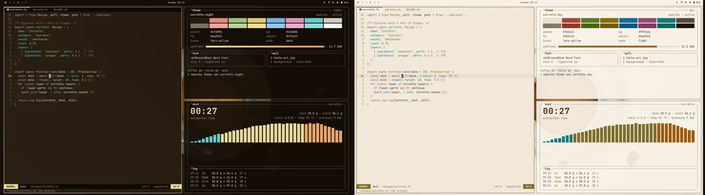](https://bjarneo.github.io/coffee-themes/#corretto)

`22` · Folder: [`corretto/`](corretto/) · [Open on the site](https://bjarneo.github.io/coffee-themes/#corretto)

Espresso with a shot of grappa. The recipe background shows the recipe.

| Variant | Theme name | `background` | `foreground` | `accent` | Icons |
| --- | --- | --- | --- | --- | --- |
| Night | [`corretto-night`](corretto/night/) | `#140d05` | `#eadfd3` | `#e7d89b` | `Yaru-yellow` |
| Day | [`corretto-day`](corretto/day/) | `#f9f1e6` | `#362c1c` | `#7e6e2c` | `Yaru-yellow` |

<details>
<summary>All 16 ANSI colors of each variant</summary>

| Variant | Normal, 0 to 7 | Bright, 8 to 15 |
| --- | --- | --- |
| Night | `#241b12` `#e48878` `#a1bd75` `#e2c56a` `#6fb3e3` `#db8fba` `#60cbc9` `#d4c8bc` | `#7d6f5f` `#f1a496` `#bad297` `#f4dd94` `#92c8f1` `#ebaace` `#8cdfdc` `#fbf6f0` |
| Day | `#eadfcf` `#a5483a` `#5c7729` `#866c01` `#19699a` `#964b78` `#137b7a` `#564b3c` | `#847968` `#933527` `#4a640b` `#6e5904` `#055884` `#853867` `#0f6665` `#1c1509` |

</details>

```bash
curl -fsSL https://bjarneo.github.io/coffee-themes/install.sh | bash -s -- corretto --set
```

### Red Eye

[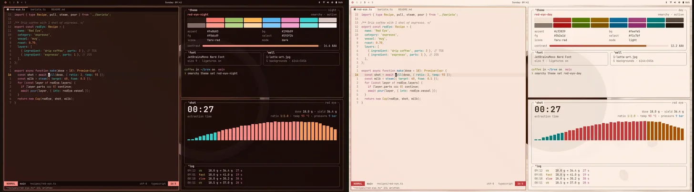](https://bjarneo.github.io/coffee-themes/#red-eye)

`23` · Signature palette · Folder: [`red-eye/`](red-eye/) · [Open on the site](https://bjarneo.github.io/coffee-themes/#red-eye)

Drip coffee with 1 shot of espresso. The recipe background shows the recipe.

| Variant | Theme name | `background` | `foreground` | `accent` | Icons |
| --- | --- | --- | --- | --- | --- |
| Night | [`red-eye-night`](red-eye/night/) | `#190b09` | `#f0dcd9` | `#fe8b83` | `Yaru-red` |
| Day | [`red-eye-day`](red-eye/day/) | `#feefe5` | `#3b2a1d` | `#c33839` | `Yaru-red` |

<details>
<summary>All 16 ANSI colors of each variant</summary>

| Variant | Normal, 0 to 7 | Bright, 8 to 15 |
| --- | --- | --- |
| Night | `#291917` `#e65e59` `#99c68f` `#ffa659` `#e1878e` `#f18db5` `#fccabd` `#dac5c1` | `#846b66` `#f3827a` `#b5daad` `#fec79c` `#efa3a8` `#ffaacb` `#fee9e4` `#fdf4f3` |
| Day | `#f0dcce` `#9e0016` `#4a7840` `#a15800` `#973f4a` `#8d2b59` `#916256` `#5a493d` | `#897669` `#820010` `#37652c` `#894a00` `#852b39` `#7b1249` `#7e4f43` `#201309` |

</details>

```bash
curl -fsSL https://bjarneo.github.io/coffee-themes/install.sh | bash -s -- red-eye --set
```

### Black Eye

[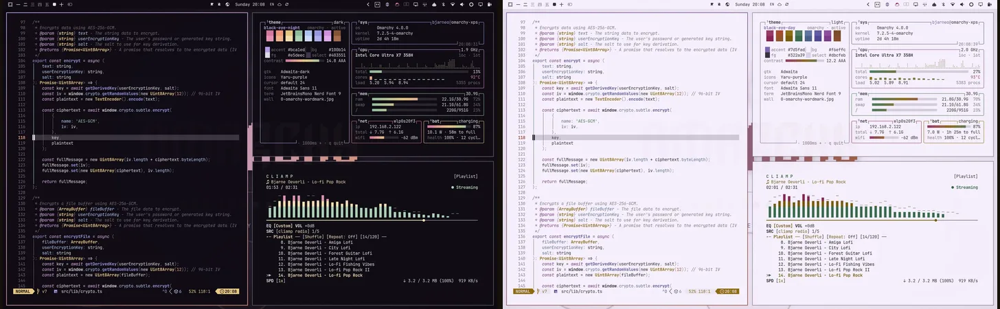](https://bjarneo.github.io/coffee-themes/#black-eye)

`24` · Signature palette · Folder: [`black-eye/`](black-eye/) · [Open on the site](https://bjarneo.github.io/coffee-themes/#black-eye)

Drip coffee with 2 shots of espresso. The recipe background shows the recipe.

| Variant | Theme name | `background` | `foreground` | `accent` | Icons |
| --- | --- | --- | --- | --- | --- |
| Night | [`black-eye-night`](black-eye/night/) | `#100b14` | `#e5deec` | `#bca1ed` | `Yaru-purple` |
| Day | [`black-eye-day`](black-eye/day/) | `#f6effc` | `#322a39` | `#7d5fad` | `Yaru-purple` |

<details>
<summary>All 16 ANSI colors of each variant</summary>

| Variant | Normal, 0 to 7 | Bright, 8 to 15 |
| --- | --- | --- |
| Night | `#1f1924` `#dd7aa2` `#94c5a4` `#efcc83` `#9d9be7` `#d695e4` `#b4cbf9` `#cfc7d6` | `#776d7f` `#ea97b8` `#b1d9bd` `#fee5b1` `#b4b3f3` `#e7b1f3` `#d4e2ff` `#f9f5fc` |
| Day | `#e5dced` `#953260` `#447757` `#8c690a` `#5a54a0` `#894798` `#596e9b` `#524959` | `#7f7687` `#831b50` `#2f6544` `#745600` `#4a428f` `#783487` `#455a87` `#19131f` |

</details>

```bash
curl -fsSL https://bjarneo.github.io/coffee-themes/install.sh | bash -s -- black-eye --set
```

### Dead Eye

[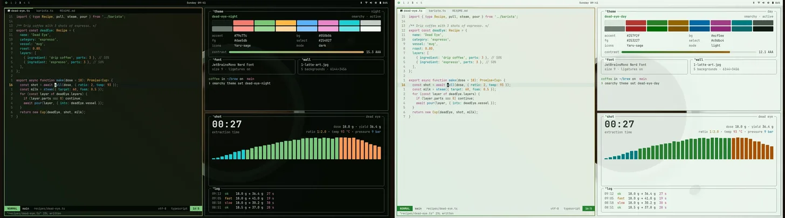](https://bjarneo.github.io/coffee-themes/#dead-eye)

`25` · Signature palette · Folder: [`dead-eye/`](dead-eye/) · [Open on the site](https://bjarneo.github.io/coffee-themes/#dead-eye)

Drip coffee with 3 shots of espresso. The recipe background shows the recipe.

| Variant | Theme name | `background` | `foreground` | `accent` | Icons |
| --- | --- | --- | --- | --- | --- |
| Night | [`dead-eye-night`](dead-eye/night/) | `#050b06` | `#dae5db` | `#79c77c` | `Yaru-sage` |
| Day | [`dead-eye-day`](dead-eye/day/) | `#ecf5ee` | `#253227` | `#257f2f` | `Yaru-sage` |

<details>
<summary>All 16 ANSI colors of each variant</summary>

| Variant | Normal, 0 to 7 | Bright, 8 to 15 |
| --- | --- | --- |
| Night | `#111913` `#d67069` `#81ce70` `#cedc69` `#6bb797` `#d4bc79` `#77e0d3` `#c2cec4` | `#67766a` `#e38d86` `#a2e194` `#e5f297` `#8ecaaf` `#e7d39d` `#a1f4e8` `#f2f9f3` |
| Day | `#d8e4da` `#942b2b` `#297f0e` `#6c7501` `#117152` `#7a6110` `#006058` `#445146` | `#6f7d71` `#821118` `#1d6a00` `#586000` `#005f43` `#675000` `#004e47` `#0f1911` |

</details>

```bash
curl -fsSL https://bjarneo.github.io/coffee-themes/install.sh | bash -s -- dead-eye --set
```

## Brewing methods

### Drip Coffee

[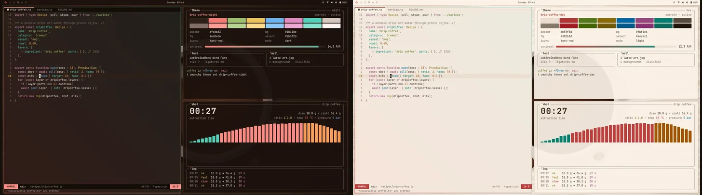](https://bjarneo.github.io/coffee-themes/#drip-coffee)

`26` · Folder: [`drip-coffee/`](drip-coffee/) · [Open on the site](https://bjarneo.github.io/coffee-themes/#drip-coffee)

A machine drips hot water through ground coffee. The recipe background shows the recipe.

| Variant | Theme name | `background` | `foreground` | `accent` | Icons |
| --- | --- | --- | --- | --- | --- |
| Night | [`drip-coffee-night`](drip-coffee/night/) | `#1b110c` | `#edded6` | `#fe8b83` | `Yaru-red` |
| Day | [`drip-coffee-day`](drip-coffee/day/) | `#fbf1e6` | `#382b1d` | `#bf3f3d` | `Yaru-red` |

<details>
<summary>All 16 ANSI colors of each variant</summary>

| Variant | Normal, 0 to 7 | Bright, 8 to 15 |
| --- | --- | --- |
| Night | `#2c2019` `#f47b74` `#9ac06c` `#ecc258` `#68b2ef` `#e08ac2` `#50d0ba` `#d7c7be` | `#826e64` `#fd9c94` `#b4d490` `#fdda88` `#8cc8fb` `#eea7d4` `#83e3d1` `#fdf5f1` |
| Day | `#ecded0` `#b33636` `#547919` `#896a0a` `#0368a5` `#9a457f` `#037d6e` `#574a3d` | `#867869` `#a11b22` `#436500` `#715708` `#03578b` `#88316e` `#0e675b` `#1e1409` |

</details>

```bash
curl -fsSL https://bjarneo.github.io/coffee-themes/install.sh | bash -s -- drip-coffee --set
```

### Pour-Over

[](https://bjarneo.github.io/coffee-themes/#pour-over)

`27` · Folder: [`pour-over/`](pour-over/) · [Open on the site](https://bjarneo.github.io/coffee-themes/#pour-over)

Hot water poured by hand through a filter. The recipe background shows the recipe.

| Variant | Theme name | `background` | `foreground` | `accent` | Icons |
| --- | --- | --- | --- | --- | --- |
| Night | [`pour-over-night`](pour-over/night/) | `#1c140d` | `#ebdfd4` | `#ed9c55` | `Yaru` |
| Day | [`pour-over-day`](pour-over/day/) | `#f9f1e6` | `#372c1d` | `#a65c03` | `Yaru` |

<details>
<summary>All 16 ANSI colors of each variant</summary>

| Variant | Normal, 0 to 7 | Bright, 8 to 15 |
| --- | --- | --- |
| Night | `#2d231a` `#e48682` `#90c180` `#fdb769` `#71b2e7` `#dc8ebb` `#5cccc8` `#d5c8bc` | `#7f7061` `#f1a29d` `#acd59f` `#ffd6ac` `#93c7f4` `#ebaace` `#89dfdc` `#fcf6f0` |
| Day | `#eaded0` `#a54745` `#487b37` `#9d6000` `#1e689d` `#974a79` `#047c79` `#564b3d` | `#847869` `#933334` `#33671f` `#824e00` `#01578a` `#853768` `#006663` `#1d1409` |

</details>

```bash
curl -fsSL https://bjarneo.github.io/coffee-themes/install.sh | bash -s -- pour-over --set
```

### French Press

[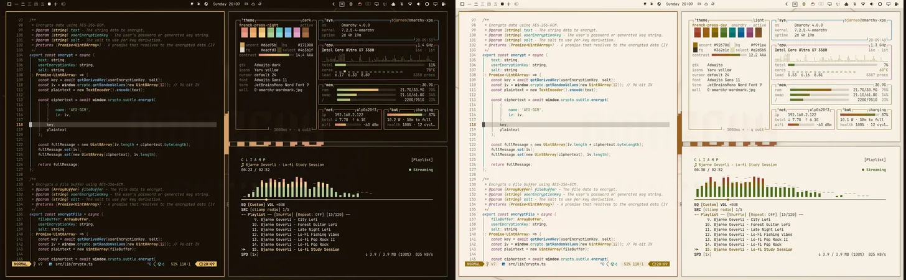](https://bjarneo.github.io/coffee-themes/#french-press)

`28` · Folder: [`french-press/`](french-press/) · [Open on the site](https://bjarneo.github.io/coffee-themes/#french-press)

Coffee steeps in water, then a metal mesh presses it down. The recipe background shows the recipe.

| Variant | Theme name | `background` | `foreground` | `accent` | Icons |
| --- | --- | --- | --- | --- | --- |
| Night | [`french-press-night`](french-press/night/) | `#171008` | `#eadfd3` | `#d6a95b` | `Yaru-yellow` |
| Day | [`french-press-day`](french-press/day/) | `#f9f1e6` | `#362c1c` | `#926706` | `Yaru-yellow` |

<details>
<summary>All 16 ANSI colors of each variant</summary>

| Variant | Normal, 0 to 7 | Bright, 8 to 15 |
| --- | --- | --- |
| Night | `#271f15` `#e38973` `#9cbe79` `#ecc16a` `#6db3e3` `#db8fba` `#61ccc6` `#d4c8bc` | `#7d6f5f` `#f1a592` `#b5d399` `#fdd995` `#90c8f0` `#ebaace` `#8ddfda` `#fbf6f0` |
| Day | `#eadfcf` `#a44934` `#56782e` `#8d6802` `#146a99` `#964b78` `#007c78` `#564b3c` | `#847968` `#923520` `#436514` `#745504` `#005884` `#853867` `#006764` `#1c1509` |

</details>

```bash
curl -fsSL https://bjarneo.github.io/coffee-themes/install.sh | bash -s -- french-press --set
```

### AeroPress

[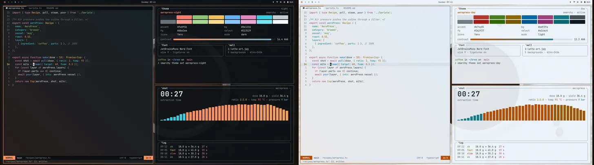](https://bjarneo.github.io/coffee-themes/#aeropress)

`29` · Folder: [`aeropress/`](aeropress/) · [Open on the site](https://bjarneo.github.io/coffee-themes/#aeropress)

Air pressure pushes the coffee through a filter. The recipe background shows the recipe.

| Variant | Theme name | `background` | `foreground` | `accent` | Icons |
| --- | --- | --- | --- | --- | --- |
| Night | [`aeropress-night`](aeropress/night/) | `#0e1216` | `#dbe2ea` | `#fe8f5b` | `Yaru` |
| Day | [`aeropress-day`](aeropress/day/) | `#edf3fa` | `#262f37` | `#b74c05` | `Yaru` |

<details>
<summary>All 16 ANSI colors of each variant</summary>

| Variant | Normal, 0 to 7 | Bright, 8 to 15 |
| --- | --- | --- |
| Night | `#1d2125` `#f47c6e` `#8cc372` `#f0bf58` `#65b2f3` `#e289c0` `#38cde0` `#c3ccd5` | `#69737d` `#fd9d90` `#a9d794` `#ffd88d` `#8ac8fe` `#f0a6d3` `#77e1f0` `#f2f7fd` |
| Day | `#d8e1eb` `#b3372e` `#457c24` `#8c680b` `#0668a6` `#9c437e` `#137986` `#464e57` | `#727b85` `#a11d18` `#2e6800` `#765600` `#04568c` `#8a2f6d` `#0b656f` `#10171e` |

</details>

```bash
curl -fsSL https://bjarneo.github.io/coffee-themes/install.sh | bash -s -- aeropress --set
```

### Chemex

[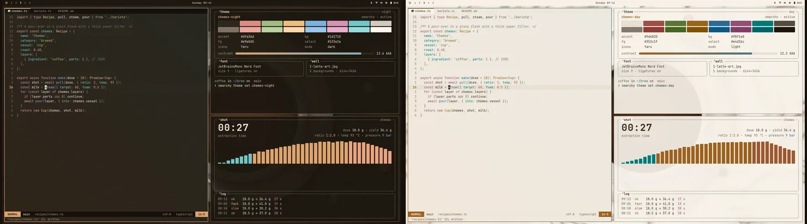](https://bjarneo.github.io/coffee-themes/#chemex)

`30` · Folder: [`chemex/`](chemex/) · [Open on the site](https://bjarneo.github.io/coffee-themes/#chemex)

A pour-over in a glass flask with a thick paper filter. The recipe background shows the recipe.

| Variant | Theme name | `background` | `foreground` | `accent` | Icons |
| --- | --- | --- | --- | --- | --- |
| Night | [`chemex-night`](chemex/night/) | `#1d1710` | `#e9e0d5` | `#dfa36d` | `Yaru` |
| Day | [`chemex-day`](chemex/day/) | `#f8f1e8` | `#352c1f` | `#9d6020` | `Yaru` |

<details>
<summary>All 16 ANSI colors of each variant</summary>

| Variant | Normal, 0 to 7 | Bright, 8 to 15 |
| --- | --- | --- |
| Night | `#2d261e` `#dc8c82` `#9fbd7f` `#f2bc7e` `#78b2de` `#d693b8` `#6dc9c9` `#d3c9bd` | `#7f7264` `#eba79e` `#b8d29f` `#fed6ab` `#98c7ec` `#e6adcc` `#94dddc` `#fbf6f0` |
| Day | `#e8dfd2` `#9e4e46` `#5a7736` `#98631a` `#286994` `#924f76` `#007a7a` `#554c3f` | `#82796b` `#8c3b34` `#476420` `#805003` `#0c5884` `#803d65` `#006565` `#1c150a` |

</details>

```bash
curl -fsSL https://bjarneo.github.io/coffee-themes/install.sh | bash -s -- chemex --set
```

### Siphon

[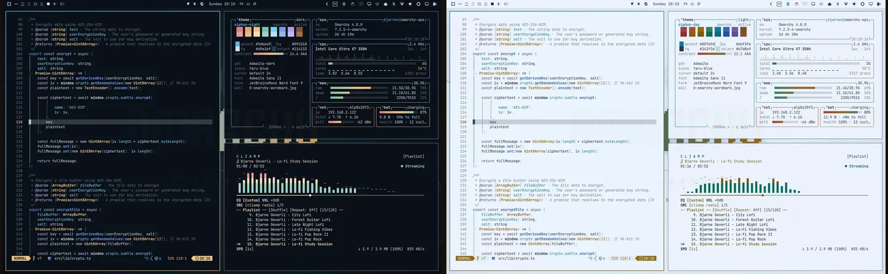](https://bjarneo.github.io/coffee-themes/#siphon)

`31` · Signature palette · Folder: [`siphon/`](siphon/) · [Open on the site](https://bjarneo.github.io/coffee-themes/#siphon)

Vapor pressure and a vacuum brew the coffee. The recipe background shows the recipe.

| Variant | Theme name | `background` | `foreground` | `accent` | Icons |
| --- | --- | --- | --- | --- | --- |
| Night | [`siphon-night`](siphon/night/) | `#091018` | `#d9e2ef` | `#5dbee9` | `Yaru-blue` |
| Day | [`siphon-day`](siphon/day/) | `#ebf3fe` | `#242f3d` | `#00769d` | `Yaru-blue` |

<details>
<summary>All 16 ANSI colors of each variant</summary>

| Variant | Normal, 0 to 7 | Bright, 8 to 15 |
| --- | --- | --- |
| Night | `#171f28` `#e68485` `#82c8b0` `#f4ca84` `#77a4f6` `#b5a4ea` `#78d9fe` `#c1ccd9` | `#667383` `#f3a1a0` `#a3dcc7` `#fee4ba` `#97bbfd` `#cabdf7` `#bbeafd` `#f2f7fe` |
| Day | `#d6e2f1` `#9c3b40` `#2a7a62` `#90670e` `#315cae` `#6c599e` `#077797` `#434e5c` | `#707b8b` `#8a262f` `#046750` `#785402` `#1f499e` `#5c478d` `#00637e` `#0e1721` |

</details>

```bash
curl -fsSL https://bjarneo.github.io/coffee-themes/install.sh | bash -s -- siphon --set
```

### Moka Pot

[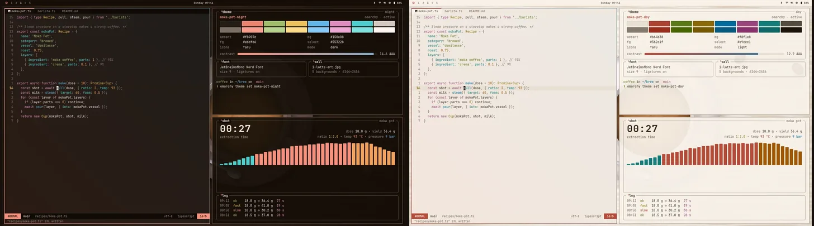](https://bjarneo.github.io/coffee-themes/#moka-pot)

`32` · Folder: [`moka-pot/`](moka-pot/) · [Open on the site](https://bjarneo.github.io/coffee-themes/#moka-pot)

Steam pressure on a stovetop makes a strong coffee. The recipe background shows the recipe.

| Variant | Theme name | `background` | `foreground` | `accent` | Icons |
| --- | --- | --- | --- | --- | --- |
| Night | [`moka-pot-night`](moka-pot/night/) | `#150e08` | `#ebdfd6` | `#f8907c` | `Yaru` |
| Day | [`moka-pot-day`](moka-pot/day/) | `#f8f1e8` | `#362c1f` | `#b64b38` | `Yaru` |

<details>
<summary>All 16 ANSI colors of each variant</summary>

| Variant | Normal, 0 to 7 | Bright, 8 to 15 |
| --- | --- | --- |
| Night | `#241c16` `#eb8370` `#9ebe6b` `#eec158` `#60b5e9` `#df8bc0` `#4bcecd` `#d5c8be` | `#7d6e63` `#f8a08f` `#b7d28f` `#ffda88` `#87caf6` `#eea7d3` `#80e1e0` `#fcf5f0` |
| Day | `#e9dfd3` `#ab4231` `#597817` `#8a690a` `#006b9b` `#9a467e` `#137b7b` `#554b3f` | `#83786b` `#992c1c` `#486400` `#745700` `#065981` `#88326d` `#0e6666` `#1c140b` |

</details>

```bash
curl -fsSL https://bjarneo.github.io/coffee-themes/install.sh | bash -s -- moka-pot --set
```

### Percolator

[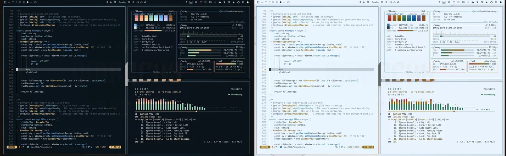](https://bjarneo.github.io/coffee-themes/#percolator)

`33` · Signature palette · Folder: [`percolator/`](percolator/) · [Open on the site](https://bjarneo.github.io/coffee-themes/#percolator)

The pot cycles boiling water through the grounds again and again. The recipe background shows the recipe.

| Variant | Theme name | `background` | `foreground` | `accent` | Icons |
| --- | --- | --- | --- | --- | --- |
| Night | [`percolator-night`](percolator/night/) | `#0a131a` | `#d7e3ee` | `#79b8ed` | `Yaru-blue` |
| Day | [`percolator-day`](percolator/day/) | `#e9f4fe` | `#21303c` | `#2b72a8` | `Yaru-blue` |

<details>
<summary>All 16 ANSI colors of each variant</summary>

| Variant | Normal, 0 to 7 | Bright, 8 to 15 |
| --- | --- | --- |
| Night | `#18222a` `#e6857e` `#8ac8a6` `#f4ca84` `#67aaed` `#b2b2e3` `#a2daf6` `#bfccd8` | `#637482` `#f3a29a` `#a9dcc0` `#fee4ba` `#8ac0f8` `#c9c9f3` `#cceeff` `#f1f8fd` |
| Day | `#d3e2f0` `#9c3c38` `#367959` `#90670e` `#1162a6` `#656494` `#3a7691` `#414f5b` | `#6d7c8a` `#8a2727` `#1f6847` `#785402` `#03518d` `#555283` `#20627d` `#0c1721` |

</details>

```bash
curl -fsSL https://bjarneo.github.io/coffee-themes/install.sh | bash -s -- percolator --set
```

### Cold Brew

[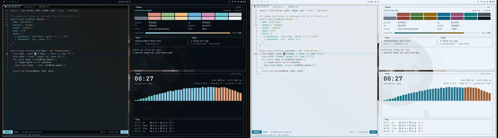](https://bjarneo.github.io/coffee-themes/#cold-brew)

`34` · Signature palette · Folder: [`cold-brew/`](cold-brew/) · [Open on the site](https://bjarneo.github.io/coffee-themes/#cold-brew)

Coffee that steeps in cold water for 12 to 24 hours. The recipe background shows the recipe.

| Variant | Theme name | `background` | `foreground` | `accent` | Icons |
| --- | --- | --- | --- | --- | --- |
| Night | [`cold-brew-night`](cold-brew/night/) | `#070d13` | `#d9e2ed` | `#8ad0eb` | `Yaru-prussiangreen` |
| Day | [`cold-brew-day`](cold-brew/day/) | `#ecf3fc` | `#242f3b` | `#237692` | `Yaru-prussiangreen` |

<details>
<summary>All 16 ANSI colors of each variant</summary>

| Variant | Normal, 0 to 7 | Bright, 8 to 15 |
| --- | --- | --- |
| Night | `#141b23` `#d78e88` `#85cfbb` `#f8c885` `#73b1e6` `#aeb3e4` `#81daef` `#c1ccd7` | `#667381` `#e6a8a2` `#a7e3d2` `#ffe3be` `#94c7f3` `#c6caf3` `#adeefe` `#f2f7fd` |
| Day | `#d7e2ed` `#8f4843` `#267c69` `#936513` `#21689c` `#616595` `#07798d` `#434e5a` | `#707c88` `#7e3632` `#086755` `#7c5409` `#00568b` `#505484` `#056576` `#0e1720` |

</details>

```bash
curl -fsSL https://bjarneo.github.io/coffee-themes/install.sh | bash -s -- cold-brew --set
```

### Nitro Cold Brew

[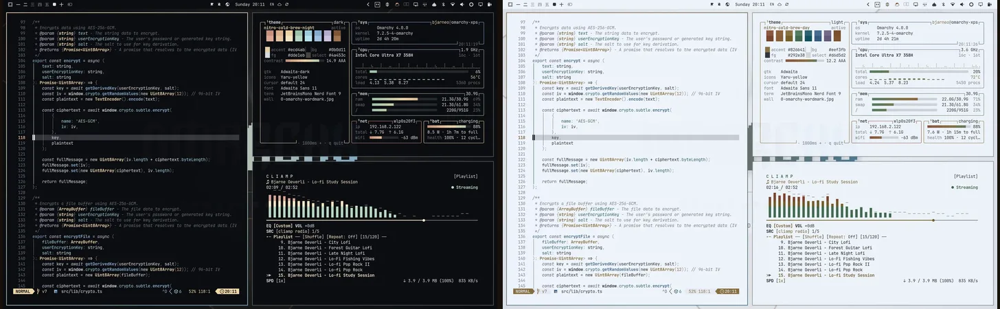](https://bjarneo.github.io/coffee-themes/#nitro-cold-brew)

`35` · Signature palette · Folder: [`nitro-cold-brew/`](nitro-cold-brew/) · [Open on the site](https://bjarneo.github.io/coffee-themes/#nitro-cold-brew)

Cold brew with nitrogen gas. It has a creamy texture. The recipe background shows the recipe.

| Variant | Theme name | `background` | `foreground` | `accent` | Icons |
| --- | --- | --- | --- | --- | --- |
| Night | [`nitro-cold-brew-night`](nitro-cold-brew/night/) | `#0b0d11` | `#dde1eb` | `#ecd4ab` | `Yaru-yellow` |
| Day | [`nitro-cold-brew-day`](nitro-cold-brew/day/) | `#eef3fb` | `#292e38` | `#826b41` | `Yaru-yellow` |

<details>
<summary>All 16 ANSI colors of each variant</summary>

| Variant | Normal, 0 to 7 | Bright, 8 to 15 |
| --- | --- | --- |
| Night | `#191c21` `#d1947f` `#a0caad` `#f5daaa` `#89afd6` `#bcb1d3` `#9fd4e6` `#c5cbd5` | `#6c727d` `#e1ad9b` `#bcdfc7` `#ffeccb` `#a6c5e5` `#d2c8e5` `#bee9f8` `#f3f7fe` |
| Day | `#dbe0ec` `#894e39` `#4d775c` `#856b39` `#40668d` `#6f6385` `#225c6c` `#484d57` | `#757a86` `#783c27` `#396549` `#715721` `#2e557c` `#5e5274` `#074b5c` `#12161e` |

</details>

```bash
curl -fsSL https://bjarneo.github.io/coffee-themes/install.sh | bash -s -- nitro-cold-brew --set
```

### Turkish Coffee

[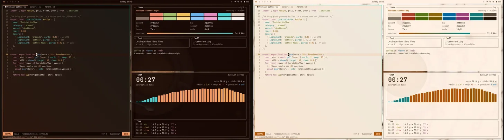](https://bjarneo.github.io/coffee-themes/#turkish-coffee)

`36` · Signature palette · Folder: [`turkish-coffee/`](turkish-coffee/) · [Open on the site](https://bjarneo.github.io/coffee-themes/#turkish-coffee)

Very fine grounds boiled in a cezve and not filtered. The recipe background shows the recipe.

| Variant | Theme name | `background` | `foreground` | `accent` | Icons |
| --- | --- | --- | --- | --- | --- |
| Night | [`turkish-coffee-night`](turkish-coffee/night/) | `#170904` | `#f0ddd4` | `#f39762` | `Yaru` |
| Day | [`turkish-coffee-day`](turkish-coffee/day/) | `#fff0e2` | `#3b2a19` | `#b15306` | `Yaru` |

<details>
<summary>All 16 ANSI colors of each variant</summary>

| Variant | Normal, 0 to 7 | Bright, 8 to 15 |
| --- | --- | --- |
| Night | `#28170f` `#e67d58` `#88c99e` `#f8c970` `#6fa7ee` `#e5848c` `#6cd9d8` `#dac6bc` | `#856b5f` `#f29a7b` `#a8ddb9` `#ffe4b4` `#8fbdf9` `#f3a0a6` `#98edec` `#fdf5f1` |
| Day | `#f1dcc9` `#9f3300` `#347a51` `#8f6807` `#2460a7` `#9b3a48` `#0b7b7b` `#5b4939` | `#897765` `#842a00` `#19673e` `#765508` `#094e96` `#892537` `#086666` `#1f1307` |

</details>

```bash
curl -fsSL https://bjarneo.github.io/coffee-themes/install.sh | bash -s -- turkish-coffee --set
```

### Cowboy Coffee

[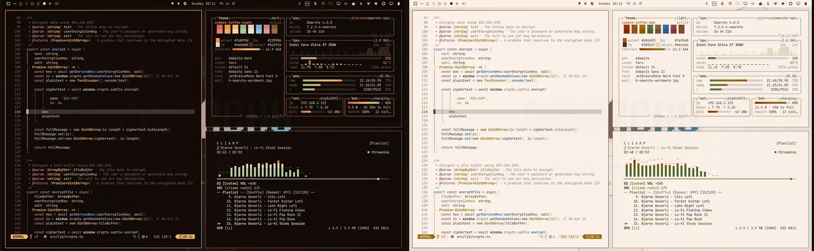](https://bjarneo.github.io/coffee-themes/#cowboy-coffee)

`37` · Signature palette · Folder: [`cowboy-coffee/`](cowboy-coffee/) · [Open on the site](https://bjarneo.github.io/coffee-themes/#cowboy-coffee)

Grounds boiled in a pot of water. The recipe background shows the recipe.

| Variant | Theme name | `background` | `foreground` | `accent` | Icons |
| --- | --- | --- | --- | --- | --- |
| Night | [`cowboy-coffee-night`](cowboy-coffee/night/) | `#120906` | `#edddd8` | `#fe8f5b` | `Yaru` |
| Day | [`cowboy-coffee-day`](cowboy-coffee/day/) | `#faf0e8` | `#382b1f` | `#b84b03` | `Yaru` |

<details>
<summary>All 16 ANSI colors of each variant</summary>

| Variant | Normal, 0 to 7 | Bright, 8 to 15 |
| --- | --- | --- |
| Night | `#211613` `#e2684a` `#a0bc86` `#ffbc64` `#7fafe2` `#d5848a` `#fdd5b7` `#d7c6c1` | `#806c66` `#ee876e` `#b9d1a4` `#fedbb0` `#9dc5ef` `#e39fa3` `#feeadb` `#fdf5f2` |
| Day | `#ebded2` `#9a2501` `#567039` `#996300` `#346698` `#8f3f49` `#825d3f` `#574a3f` | `#86776b` `#7f1b00` `#455f26` `#7f5100` `#1f5587` `#7d2c38` `#714c2d` `#1e140b` |

</details>

```bash
curl -fsSL https://bjarneo.github.io/coffee-themes/install.sh | bash -s -- cowboy-coffee --set
```

## Iced and cold drinks

### Iced Coffee

[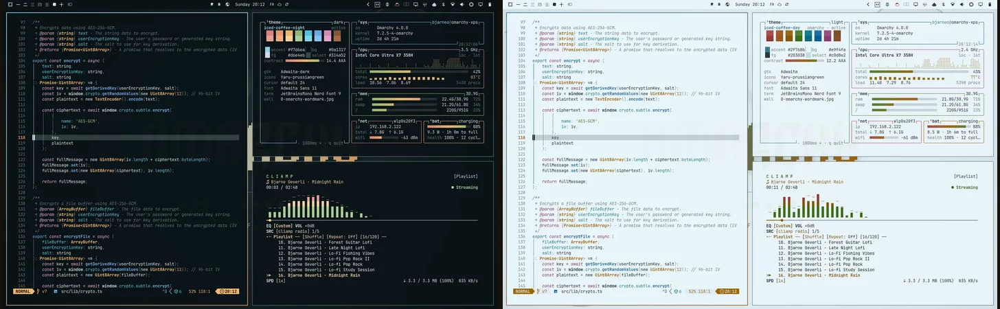](https://bjarneo.github.io/coffee-themes/#iced-coffee)

`38` · Folder: [`iced-coffee/`](iced-coffee/) · [Open on the site](https://bjarneo.github.io/coffee-themes/#iced-coffee)

Brewed coffee served over ice. The recipe background shows the recipe.

| Variant | Theme name | `background` | `foreground` | `accent` | Icons |
| --- | --- | --- | --- | --- | --- |
| Night | [`iced-coffee-night`](iced-coffee/night/) | `#0a1317` | `#d6e4eb` | `#97d6ea` | `Yaru-prussiangreen` |
| Day | [`iced-coffee-day`](iced-coffee/day/) | `#e9f4fa` | `#203038` | `#2f768b` | `Yaru-prussiangreen` |

<details>
<summary>All 16 ANSI colors of each variant</summary>

| Variant | Normal, 0 to 7 | Bright, 8 to 15 |
| --- | --- | --- |
| Night | `#182227` `#e48681` `#92c178` `#f5bb6e` `#6eb1ed` `#dc8dbe` `#50cae0` `#becdd5` | `#63757e` `#f1a29c` `#add599` `#ffd6a3` `#90c7f9` `#eba9d1` `#82def0` `#f0f8fc` |
| Day | `#d4e3eb` `#a54744` `#4b7b2d` `#986402` `#1767a3` `#97497c` `#0c7989` `#405058` | `#6c7d86` `#933332` `#366711` `#7e5203` `#00568d` `#86366b` `#066573` `#0b181e` |

</details>

```bash
curl -fsSL https://bjarneo.github.io/coffee-themes/install.sh | bash -s -- iced-coffee --set
```

### Iced Latte

[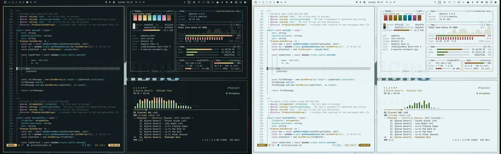](https://bjarneo.github.io/coffee-themes/#iced-latte)

`39` · Folder: [`iced-latte/`](iced-latte/) · [Open on the site](https://bjarneo.github.io/coffee-themes/#iced-latte)

Espresso and cold milk over ice. The recipe background shows the recipe.

| Variant | Theme name | `background` | `foreground` | `accent` | Icons |
| --- | --- | --- | --- | --- | --- |
| Night | [`iced-latte-night`](iced-latte/night/) | `#111a1d` | `#d6e4e9` | `#eddcb9` | `Yaru-yellow` |
| Day | [`iced-latte-day`](iced-latte/day/) | `#eaf5f8` | `#203136` | `#7f6c45` | `Yaru-yellow` |

<details>
<summary>All 16 ANSI colors of each variant</summary>

| Variant | Normal, 0 to 7 | Bright, 8 to 15 |
| --- | --- | --- |
| Night | `#1f2a2d` `#dc8b86` `#94c084` `#e5c379` `#69b6dc` `#d792ba` `#66cacc` `#beced3` | `#65787e` `#eaa6a1` `#b0d4a3` `#f7dba0` `#8ecbeb` `#e7adce` `#8fdedf` `#f0f9fb` |
| Day | `#d4e3e8` `#9e4d4a` `#4d793c` `#8d6a0c` `#016c93` `#924e78` `#117b7d` `#405056` | `#6c7e84` `#8c3a39` `#396627` `#755701` `#005a7b` `#803c67` `#0f6668` `#0b181d` |

</details>

```bash
curl -fsSL https://bjarneo.github.io/coffee-themes/install.sh | bash -s -- iced-latte --set
```

### Shakerato

[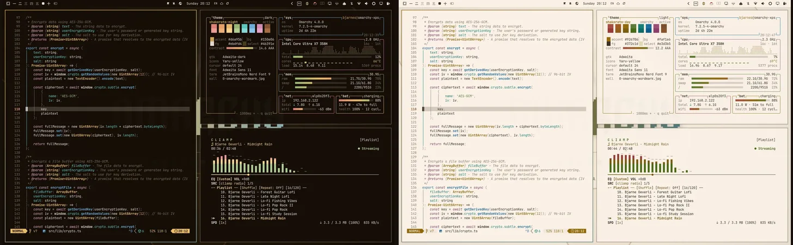](https://bjarneo.github.io/coffee-themes/#shakerato)

`40` · Folder: [`shakerato/`](shakerato/) · [Open on the site](https://bjarneo.github.io/coffee-themes/#shakerato)

Espresso shaken with ice and sugar. The recipe background shows the recipe.

| Variant | Theme name | `background` | `foreground` | `accent` | Icons |
| --- | --- | --- | --- | --- | --- |
| Night | [`shakerato-night`](shakerato/night/) | `#150e06` | `#ebdfd4` | `#d6a95b` | `Yaru-yellow` |
| Day | [`shakerato-day`](shakerato/day/) | `#faf1e6` | `#372c1d` | `#926706` | `Yaru-yellow` |

<details>
<summary>All 16 ANSI colors of each variant</summary>

| Variant | Normal, 0 to 7 | Bright, 8 to 15 |
| --- | --- | --- |
| Night | `#251c13` `#e4877c` `#9bbe78` `#eebf6b` `#6eb3e4` `#dc8fba` `#5fccc7` `#d5c8bc` | `#7e6e60` `#f1a399` `#b5d298` `#fed894` `#91c8f2` `#ecaace` `#8bdfdb` `#fcf6f0` |
| Day | `#eadecf` `#a5483f` `#56782d` `#8f6704` `#16699b` `#974a77` `#0e7c78` `#564b3d` | `#847869` `#93342d` `#436512` `#775609` `#015885` `#853766` `#076663` `#1d1409` |

</details>

```bash
curl -fsSL https://bjarneo.github.io/coffee-themes/install.sh | bash -s -- shakerato --set
```

### Espresso Tonic

[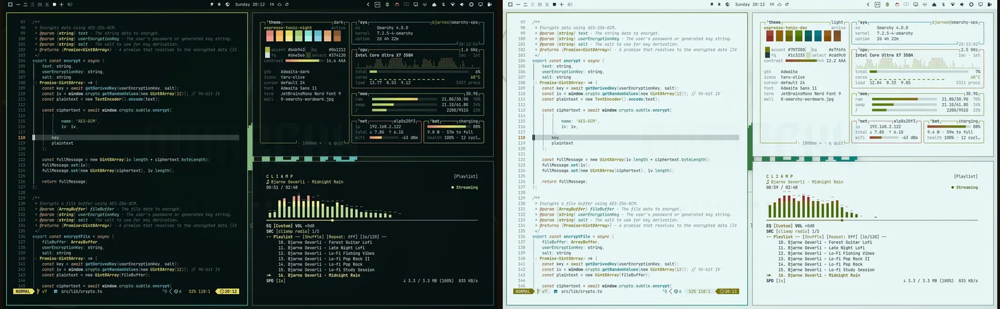](https://bjarneo.github.io/coffee-themes/#espresso-tonic)

`41` · Signature palette · Folder: [`espresso-tonic/`](espresso-tonic/) · [Open on the site](https://bjarneo.github.io/coffee-themes/#espresso-tonic)

Espresso poured over tonic water. The recipe background shows the recipe.

| Variant | Theme name | `background` | `foreground` | `accent` | Icons |
| --- | --- | --- | --- | --- | --- |
| Night | [`espresso-tonic-night`](espresso-tonic/night/) | `#061212` | `#d4e5e6` | `#b4b943` | `Yaru-olive` |
| Day | [`espresso-tonic-day`](espresso-tonic/day/) | `#e7f6f6` | `#1c3233` | `#707300` | `Yaru-olive` |

<details>
<summary>All 16 ANSI colors of each variant</summary>

| Variant | Normal, 0 to 7 | Bright, 8 to 15 |
| --- | --- | --- |
| Night | `#132122` `#e68677` `#a2ce72` `#ede361` `#65c1d1` `#e0a26f` `#89e5d9` `#bccfd0` | `#5f7778` `#f3a395` `#bde297` `#fbf48f` `#8dd5e2` `#f0bb91` `#b0f9ef` `#f0f9f9` |
| Day | `#d1e5e6` `#9c3d30` `#507b06` `#787006` `#067482` `#935619` `#006058` `#3d5152` | `#697f80` `#8a281d` `#406500` `#645d05` `#09616d` `#804500` `#034d47` `#08191a` |

</details>

```bash
curl -fsSL https://bjarneo.github.io/coffee-themes/install.sh | bash -s -- espresso-tonic --set
```

### Japanese Iced Coffee

[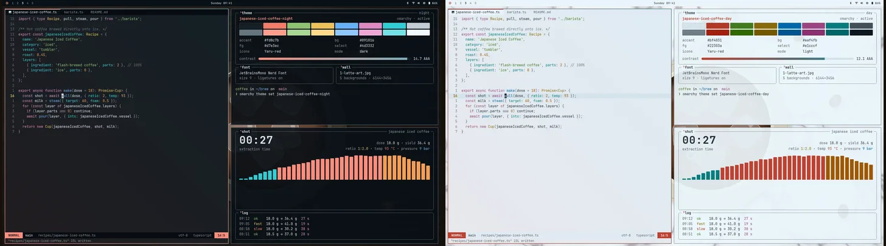](https://bjarneo.github.io/coffee-themes/#japanese-iced-coffee)

`42` · Signature palette · Folder: [`japanese-iced-coffee/`](japanese-iced-coffee/) · [Open on the site](https://bjarneo.github.io/coffee-themes/#japanese-iced-coffee)

Hot coffee brewed directly onto ice. The recipe background shows the recipe.

| Variant | Theme name | `background` | `foreground` | `accent` | Icons |
| --- | --- | --- | --- | --- | --- |
| Night | [`japanese-iced-coffee-night`](japanese-iced-coffee/night/) | `#091016` | `#d7e3ec` | `#fd8c7b` | `Yaru-red` |
| Day | [`japanese-iced-coffee-day`](japanese-iced-coffee/day/) | `#eaf4fb` | `#22303a` | `#bf4031` | `Yaru-red` |

<details>
<summary>All 16 ANSI colors of each variant</summary>

| Variant | Normal, 0 to 7 | Bright, 8 to 15 |
| --- | --- | --- |
| Night | `#171f26` `#e36650` `#a0c398` `#efcc83` `#86a4e4` `#eb9dbb` `#99d5ed` `#c0cdd6` | `#647480` `#ee8672` `#bbd8b4` `#fee5b1` `#a1bbf0` `#fab8d1` `#b9eaff` `#f1f8fd` |
| Day | `#d5e2ec` `#a01700` `#52754b` `#8c690a` `#415d9d` `#994d6d` `#35768e` `#414f59` | `#6e7d87` `#831200` `#416439` `#765702` `#304b8c` `#873a5c` `#1b637b` `#0d171f` |

</details>

```bash
curl -fsSL https://bjarneo.github.io/coffee-themes/install.sh | bash -s -- japanese-iced-coffee --set
```

### Greek Frappé

[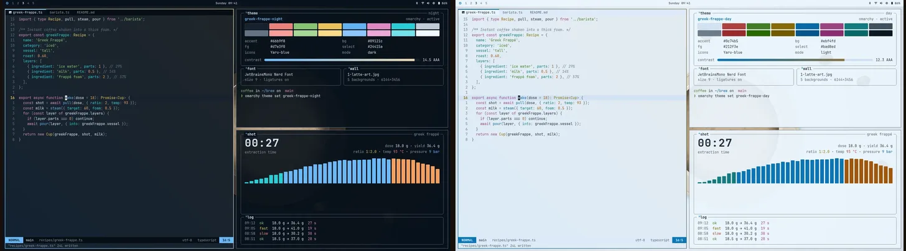](https://bjarneo.github.io/coffee-themes/#greek-frappe)

`43` · Signature palette · Folder: [`greek-frappe/`](greek-frappe/) · [Open on the site](https://bjarneo.github.io/coffee-themes/#greek-frappe)

Instant coffee shaken into a thick foam. The recipe background shows the recipe.

| Variant | Theme name | `background` | `foreground` | `accent` | Icons |
| --- | --- | --- | --- | --- | --- |
| Night | [`greek-frappe-night`](greek-frappe/night/) | `#09121c` | `#d7e3f0` | `#6bb9f8` | `Yaru-blue` |
| Day | [`greek-frappe-day`](greek-frappe/day/) | `#ebf4fd` | `#212f3e` | `#0c74b5` | `Yaru-blue` |

<details>
<summary>All 16 ANSI colors of each variant</summary>

| Variant | Normal, 0 to 7 | Bright, 8 to 15 |
| --- | --- | --- |
| Night | `#17212d` `#e6857e` `#82c8b0` `#f7dba1` `#64a9f3` `#87c8e8` `#79e4f0` `#bfccda` | `#637385` `#f3a29a` `#a3dcc7` `#feedc9` `#88bffd` `#a8ddf8` `#aef6ff` `#f2f7fd` |
| Day | `#d2e2f4` `#9c3c38` `#2a7a62` `#866b2d` `#0b61ac` `#2e7796` `#0b6870` `#404f5e` | `#6d7c8c` `#8a2727` `#046750` `#745813` `#045091` `#0b6382` `#0b555c` `#0c1722` |

</details>

```bash
curl -fsSL https://bjarneo.github.io/coffee-themes/install.sh | bash -s -- greek-frappe --set
```

### Dalgona Coffee

[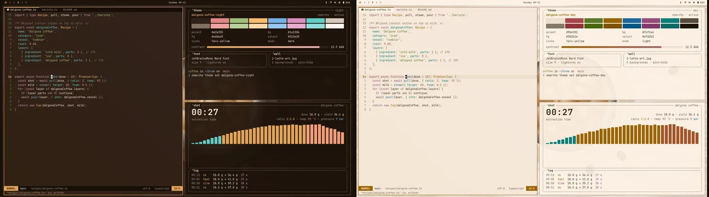](https://bjarneo.github.io/coffee-themes/#dalgona-coffee)

`44` · Signature palette · Folder: [`dalgona-coffee/`](dalgona-coffee/) · [Open on the site](https://bjarneo.github.io/coffee-themes/#dalgona-coffee)

Whipped instant coffee on top of milk. The recipe background shows the recipe.

| Variant | Theme name | `background` | `foreground` | `accent` | Icons |
| --- | --- | --- | --- | --- | --- |
| Night | [`dalgona-coffee-night`](dalgona-coffee/night/) | `#1e130b` | `#edded3` | `#e2a355` | `Yaru-yellow` |
| Day | [`dalgona-coffee-day`](dalgona-coffee/day/) | `#fcf1e4` | `#382b1a` | `#9b6203` | `Yaru-yellow` |

<details>
<summary>All 16 ANSI colors of each variant</summary>

| Variant | Normal, 0 to 7 | Bright, 8 to 15 |
| --- | --- | --- |
| Night | `#2f2218` `#e1878e` `#b1bf8c` `#fcbe62` `#d59c7d` `#f4acc7` `#eaddc1` `#d7c7bb` | `#826f5f` `#efa3a8` `#c9d4aa` `#fedbad` `#e5b59b` `#fecadd` `#f9edd6` `#fcf5f0` |
| Day | `#eddecc` `#973f4a` `#64713d` `#976500` `#8a5434` `#9d5874` `#605439` `#584b3b` | `#867867` `#852b39` `#54602a` `#7d5300` `#794220` `#8a4461` `#504328` `#1e1407` |

</details>

```bash
curl -fsSL https://bjarneo.github.io/coffee-themes/install.sh | bash -s -- dalgona-coffee --set
```

### Mazagran

[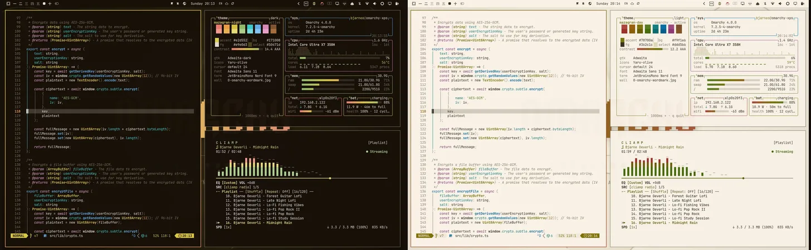](https://bjarneo.github.io/coffee-themes/#mazagran)

`45` · Folder: [`mazagran/`](mazagran/) · [Open on the site](https://bjarneo.github.io/coffee-themes/#mazagran)

Iced coffee with lemon. The recipe background shows the recipe.

| Variant | Theme name | `background` | `foreground` | `accent` | Icons |
| --- | --- | --- | --- | --- | --- |
| Night | [`mazagran-night`](mazagran/night/) | `#171008` | `#e9e0d3` | `#e2d552` | `Yaru-olive` |
| Day | [`mazagran-day`](mazagran/day/) | `#f9f1e6` | `#362c1c` | `#78700a` | `Yaru-olive` |

<details>
<summary>All 16 ANSI colors of each variant</summary>

| Variant | Normal, 0 to 7 | Bright, 8 to 15 |
| --- | --- | --- |
| Night | `#271f15` `#ec8273` `#96c16d` `#ddc943` `#63b3ef` `#e08ac2` `#3fced1` `#d3c9bb` | `#7c6f5e` `#f8a092` `#b1d591` `#f0e07c` `#89c8fb` `#efa7d4` `#7ae1e3` `#fbf6f0` |
| Day | `#e9dfcf` `#ac4135` `#517a1b` `#7c6e00` `#0069a3` `#9b457f` `#0d7b7d` `#554c3c` | `#837968` `#9a2b21` `#406603` `#675b00` `#005789` `#89316f` `#076668` `#1c1508` |

</details>

```bash
curl -fsSL https://bjarneo.github.io/coffee-themes/install.sh | bash -s -- mazagran --set
```

## Regional drinks

### Irish Coffee

[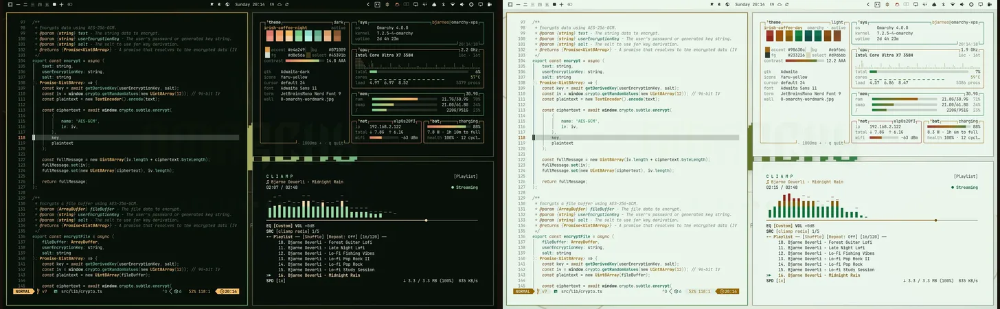](https://bjarneo.github.io/coffee-themes/#irish-coffee)

`46` · Signature palette · Origin: Ireland · Folder: [`irish-coffee/`](irish-coffee/) · [Open on the site](https://bjarneo.github.io/coffee-themes/#irish-coffee)

Coffee, Irish whiskey, sugar and cream. The recipe background shows the recipe.

| Variant | Theme name | `background` | `foreground` | `accent` | Icons |
| --- | --- | --- | --- | --- | --- |
| Night | [`irish-coffee-night`](irish-coffee/night/) | `#071009` | `#d8e5da` | `#e4a249` | `Yaru-yellow` |
| Day | [`irish-coffee-day`](irish-coffee/day/) | `#ebf6ec` | `#233226` | `#98630c` | `Yaru-yellow` |

<details>
<summary>All 16 ANSI colors of each variant</summary>

| Variant | Normal, 0 to 7 | Bright, 8 to 15 |
| --- | --- | --- |
| Night | `#141f16` `#e47d6d` `#76cf8a` `#fcbe62` `#65b090` `#e0a26f` `#95e3d3` `#c1cfc3` | `#667768` `#f19a8c` `#9be2a9` `#fedbad` `#87c3a8` `#f0bb91` `#b8f7ea` `#f2f9f3` |
| Day | `#d5e5d8` `#9c3428` `#0c7f3b` `#976500` `#0a6d4f` `#8a4d0c` `#07564b` `#435245` | `#6f7f72` `#8a1d13` `#056b2f` `#7d5300` `#045a40` `#733f04` `#07443b` `#0e1910` |

</details>

```bash
curl -fsSL https://bjarneo.github.io/coffee-themes/install.sh | bash -s -- irish-coffee --set
```

### Café au Lait

[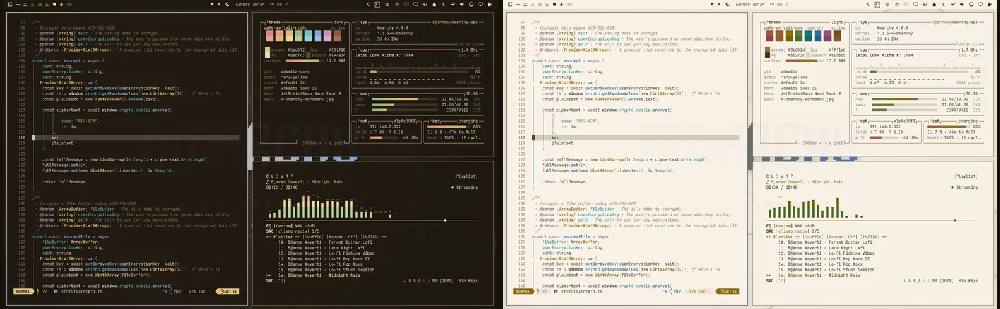](https://bjarneo.github.io/coffee-themes/#cafe-au-lait)

`47` · Origin: France · Folder: [`cafe-au-lait/`](cafe-au-lait/) · [Open on the site](https://bjarneo.github.io/coffee-themes/#cafe-au-lait)

Brewed coffee with hot milk. The recipe background shows the recipe.

| Variant | Theme name | `background` | `foreground` | `accent` | Icons |
| --- | --- | --- | --- | --- | --- |
| Night | [`cafe-au-lait-night`](cafe-au-lait/night/) | `#201910` | `#eadfd3` | `#ebc892` | `Yaru-yellow` |
| Day | [`cafe-au-lait-day`](cafe-au-lait/day/) | `#f9f1e6` | `#362c1c` | `#8b682d` | `Yaru-yellow` |

<details>
<summary>All 16 ANSI colors of each variant</summary>

| Variant | Normal, 0 to 7 | Bright, 8 to 15 |
| --- | --- | --- |
| Night | `#31281e` `#dc8b87` `#9ebd80` `#e7c27a` `#80afe2` `#d493bd` `#6dc9ca` `#d4c9bb` | `#837564` `#eba6a2` `#b7d29f` `#f9daa0` `#9ec5f0` `#e4aed0` `#94dddd` `#fbf6f0` |
| Day | `#e9dfcf` `#9e4d4b` `#587738` `#8d680a` `#356699` `#90507a` `#007a7b` `#554c3c` | `#837968` `#8c3a39` `#466422` `#775602` `#215588` `#7e3e6a` `#006566` `#1c1509` |

</details>

```bash
curl -fsSL https://bjarneo.github.io/coffee-themes/install.sh | bash -s -- cafe-au-lait --set
```

### Café Cubano

[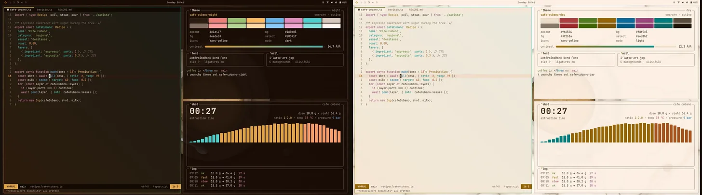](https://bjarneo.github.io/coffee-themes/#cafe-cubano)

`48` · Origin: Cuba · Folder: [`cafe-cubano/`](cafe-cubano/) · [Open on the site](https://bjarneo.github.io/coffee-themes/#cafe-cubano)

Espresso sweetened with sugar during the brew. The recipe background shows the recipe.

| Variant | Theme name | `background` | `foreground` | `accent` | Icons |
| --- | --- | --- | --- | --- | --- |
| Night | [`cafe-cubano-night`](cafe-cubano/night/) | `#180c05` | `#eeded3` | `#e1a447` | `Yaru-yellow` |
| Day | [`cafe-cubano-day`](cafe-cubano/day/) | `#fdf0e3` | `#392b1a` | `#966506` | `Yaru-yellow` |

<details>
<summary>All 16 ANSI colors of each variant</summary>

| Variant | Normal, 0 to 7 | Bright, 8 to 15 |
| --- | --- | --- |
| Night | `#291b11` `#ec817d` `#97c071` `#f9ba5c` `#63b4ea` `#e18bbe` `#4ccecb` `#d8c7bb` | `#836c5e` `#f99f9a` `#b2d493` `#ffd7a0` `#89c9f7` `#f0a7d1` `#80e1de` `#fcf5f1` |
| Day | `#eeddca` `#ac3f40` `#517a22` `#966508` `#0b6a9c` `#9b457b` `#007c7a` `#594a3a` | `#877766` `#9a292e` `#3e6503` `#7c5306` `#015884` `#89316a` `#0c6564` `#1e1407` |

</details>

```bash
curl -fsSL https://bjarneo.github.io/coffee-themes/install.sh | bash -s -- cafe-cubano --set
```

### Cortadito

[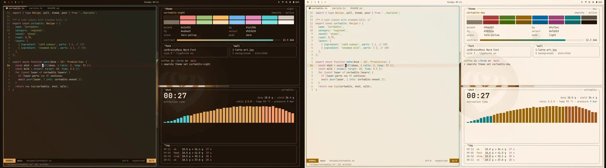](https://bjarneo.github.io/coffee-themes/#cortadito)

`49` · Origin: Cuba · Folder: [`cortadito/`](cortadito/) · [Open on the site](https://bjarneo.github.io/coffee-themes/#cortadito)

A café cubano with steamed milk. The recipe background shows the recipe.

| Variant | Theme name | `background` | `foreground` | `accent` | Icons |
| --- | --- | --- | --- | --- | --- |
| Night | [`cortadito-night`](cortadito/night/) | `#1e130b` | `#edded3` | `#e2a355` | `Yaru-yellow` |
| Day | [`cortadito-day`](cortadito/day/) | `#fcf1e4` | `#382b1a` | `#9b6203` | `Yaru-yellow` |

<details>
<summary>All 16 ANSI colors of each variant</summary>

| Variant | Normal, 0 to 7 | Bright, 8 to 15 |
| --- | --- | --- |
| Night | `#2f2218` `#ec8278` `#99c06f` `#fbb95d` `#69b2ec` `#e28abb` `#4bcdd0` `#d7c7bb` | `#826f5f` `#f99f96` `#b3d493` `#fed7a4` `#8cc8f8` `#f1a7ce` `#7fe1e2` `#fcf5f0` |
| Day | `#eddecc` `#ac403a` `#53791f` `#97640b` `#0669a3` `#9d4578` `#127b7d` `#584b3b` | `#867867` `#9a2a27` `#416600` `#7d5208` `#075788` `#8b3168` `#0e6668` `#1e1407` |

</details>

```bash
curl -fsSL https://bjarneo.github.io/coffee-themes/install.sh | bash -s -- cortadito --set
```

### Café Bombón

[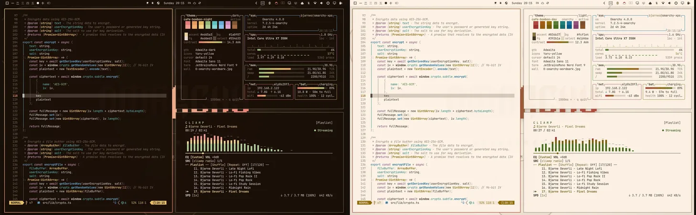](https://bjarneo.github.io/coffee-themes/#cafe-bombon)

`50` · Origin: Spain · Folder: [`cafe-bombon/`](cafe-bombon/) · [Open on the site](https://bjarneo.github.io/coffee-themes/#cafe-bombon)

Espresso with sweetened condensed milk. The recipe background shows the recipe.

| Variant | Theme name | `background` | `foreground` | `accent` | Icons |
| --- | --- | --- | --- | --- | --- |
| Night | [`cafe-bombon-night`](cafe-bombon/night/) | `#1a0f07` | `#edded3` | `#edd5a3` | `Yaru-yellow` |
| Day | [`cafe-bombon-day`](cafe-bombon/day/) | `#fcf1e4` | `#392b1a` | `#836b37` | `Yaru-yellow` |

<details>
<summary>All 16 ANSI colors of each variant</summary>

| Variant | Normal, 0 to 7 | Bright, 8 to 15 |
| --- | --- | --- |
| Night | `#2a1d14` `#eb8278` `#99bf7b` `#eac16a` `#6db3e3` `#d990bf` `#60cbc9` `#d7c7bb` | `#816d5e` `#f7a095` `#b4d39b` `#fbda94` `#90c8f0` `#e9abd2` `#8cdfdc` `#fcf5f0` |
| Day | `#eddecc` `#ab413a` `#537930` `#8c6801` `#136a99` `#944b7c` `#137b7a` `#584b3b` | `#867867` `#992c27` `#416618` `#745706` `#005884` `#82386b` `#0f6665` `#1e1407` |

</details>

```bash
curl -fsSL https://bjarneo.github.io/coffee-themes/install.sh | bash -s -- cafe-bombon --set
```

### Carajillo

[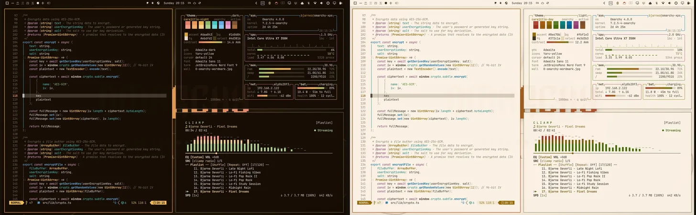](https://bjarneo.github.io/coffee-themes/#carajillo)

`51` · Origin: Spain and Mexico · Folder: [`carajillo/`](carajillo/) · [Open on the site](https://bjarneo.github.io/coffee-themes/#carajillo)

Coffee with brandy or Licor 43. The recipe background shows the recipe.

| Variant | Theme name | `background` | `foreground` | `accent` | Icons |
| --- | --- | --- | --- | --- | --- |
| Night | [`carajillo-night`](carajillo/night/) | `#160d04` | `#ebdfd2` | `#daa843` | `Yaru-yellow` |
| Day | [`carajillo-day`](carajillo/day/) | `#fbf1e3` | `#372c1a` | `#8e670b` | `Yaru-yellow` |

<details>
<summary>All 16 ANSI colors of each variant</summary>

| Variant | Normal, 0 to 7 | Bright, 8 to 15 |
| --- | --- | --- |
| Night | `#261c10` `#eb8370` `#97c071` `#f4bd5a` `#68b3ec` `#e08bbf` `#4cceca` `#d5c8ba` | `#7f6e5c` `#f8a08f` `#b2d493` `#ffd896` `#8dc8f9` `#efa7d2` `#80e1de` `#fbf6f0` |
| Day | `#ebdecb` `#ab4230` `#517a22` `#926701` `#0369a2` `#9b457d` `#007c7a` `#574b3a` | `#857866` `#992c1b` `#3e6503` `#795401` `#045788` `#89326c` `#0c6563` `#1d1407` |

</details>

```bash
curl -fsSL https://bjarneo.github.io/coffee-themes/install.sh | bash -s -- carajillo --set
```

### Café de Olla

[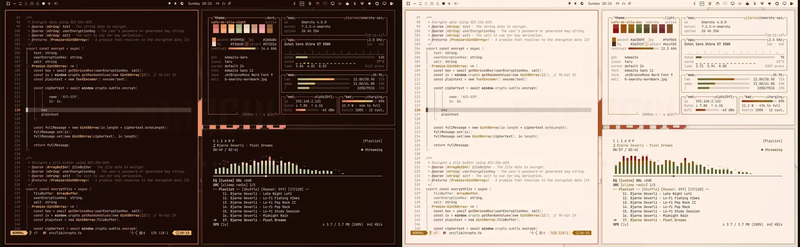](https://bjarneo.github.io/coffee-themes/#cafe-de-olla)

`52` · Signature palette · Origin: Mexico · Folder: [`cafe-de-olla/`](cafe-de-olla/) · [Open on the site](https://bjarneo.github.io/coffee-themes/#cafe-de-olla)

Coffee with cinnamon and piloncillo sugar. The recipe background shows the recipe.

| Variant | Theme name | `background` | `foreground` | `accent` | Icons |
| --- | --- | --- | --- | --- | --- |
| Night | [`cafe-de-olla-night`](cafe-de-olla/night/) | `#1b0a06` | `#f3dbd5` | `#f0995b` | `Yaru` |
| Day | [`cafe-de-olla-day`](cafe-de-olla/day/) | `#fef0e5` | `#3d2919` | `#ab5809` | `Yaru` |

<details>
<summary>All 16 ANSI colors of each variant</summary>

| Variant | Normal, 0 to 7 | Bright, 8 to 15 |
| --- | --- | --- |
| Night | `#2d1813` `#da6d5d` `#abb886` `#ffbc6a` `#cf957b` `#e9979d` `#eddcb9` `#ddc4be` | `#886961` `#e68b7c` `#c2cda4` `#ffdbb2` `#dfae98` `#f8b2b6` `#fbedd0` `#fdf5f2` |
| Day | `#f3dbc9` `#98271b` `#616d3a` `#9a6208` `#884f35` `#7e303a` `#645432` `#5c493a` | `#8c7767` `#860700` `#505c26` `#7f5005` `#773d22` `#6c1d2a` `#544320` `#201308` |

</details>

```bash
curl -fsSL https://bjarneo.github.io/coffee-themes/install.sh | bash -s -- cafe-de-olla --set
```

### Cà Phê Sữa Đá

[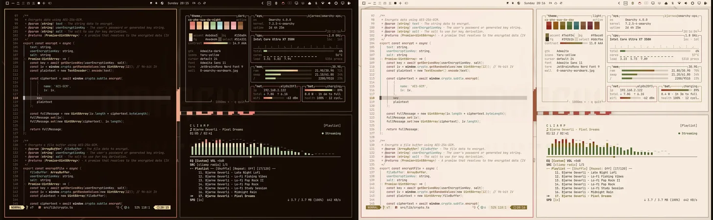](https://bjarneo.github.io/coffee-themes/#ca-phe-sua-da)

`53` · Signature palette · Origin: Vietnam · Folder: [`ca-phe-sua-da/`](ca-phe-sua-da/) · [Open on the site](https://bjarneo.github.io/coffee-themes/#ca-phe-sua-da)

Strong iced coffee with condensed milk. The recipe background shows the recipe.

| Variant | Theme name | `background` | `foreground` | `accent` | Icons |
| --- | --- | --- | --- | --- | --- |
| Night | [`ca-phe-sua-da-night`](ca-phe-sua-da/night/) | `#150a04` | `#eeded4` | `#ebd6a3` | `Yaru-yellow` |
| Day | [`ca-phe-sua-da-day`](ca-phe-sua-da/day/) | `#f8ece0` | `#392b1b` | `#7e6934` | `Yaru-yellow` |

<details>
<summary>All 16 ANSI colors of each variant</summary>

| Variant | Normal, 0 to 7 | Bright, 8 to 15 |
| --- | --- | --- |
| Night | `#251810` `#e47d6d` `#a7c28c` `#f4dca1` `#d09e83` `#efa3a8` `#a6d6d2` `#d8c7bc` | `#826d5f` `#f19a8c` `#c0d7aa` `#feedc5` `#e0b7a0` `#febec2` `#c4ebe8` `#fcf5f1` |
| Day | `#e9d9c8` `#9c3428` `#59743d` `#81692a` `#86563b` `#79343c` `#427370` `#584a3b` | `#847564` `#8a1d13` `#476128` `#6d550c` `#754528` `#68212c` `#2d615d` `#1e1407` |

</details>

```bash
curl -fsSL https://bjarneo.github.io/coffee-themes/install.sh | bash -s -- ca-phe-sua-da --set
```

### Cà Phê Trứng

[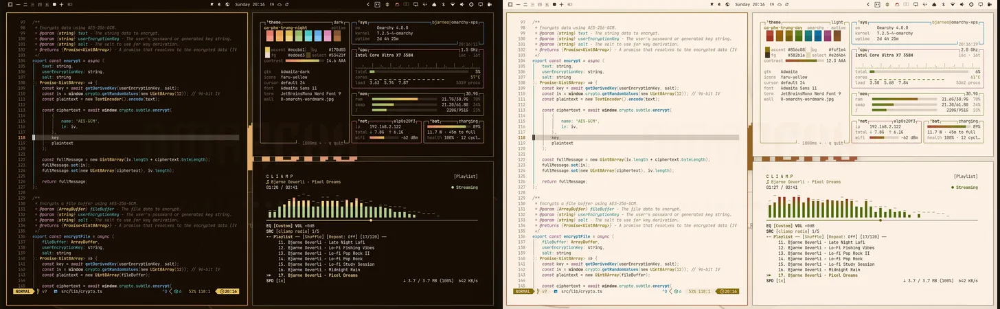](https://bjarneo.github.io/coffee-themes/#ca-phe-trung)

`54` · Origin: Vietnam · Folder: [`ca-phe-trung/`](ca-phe-trung/) · [Open on the site](https://bjarneo.github.io/coffee-themes/#ca-phe-trung)

Coffee topped with whipped egg yolk. The recipe background shows the recipe.

| Variant | Theme name | `background` | `foreground` | `accent` | Icons |
| --- | --- | --- | --- | --- | --- |
| Night | [`ca-phe-trung-night`](ca-phe-trung/night/) | `#170d05` | `#edded3` | `#eccb61` | `Yaru-yellow` |
| Day | [`ca-phe-trung-day`](ca-phe-trung/day/) | `#fcf1e4` | `#382b1a` | `#856c08` | `Yaru-yellow` |

<details>
<summary>All 16 ANSI colors of each variant</summary>

| Variant | Normal, 0 to 7 | Bright, 8 to 15 |
| --- | --- | --- |
| Night | `#271b11` `#eb836e` `#9cbf6d` `#e9c358` `#65b3eb` `#e18bbe` `#4bcece` `#d7c7bb` | `#816d5e` `#f8a08d` `#b5d391` `#fadb88` `#8ac9f7` `#f0a7d1` `#80e1e1` `#fcf5f0` |
| Day | `#eddecc` `#ab422e` `#56791c` `#876b09` `#036a9f` `#9b457b` `#137b7b` `#584b3b` | `#867867` `#992c18` `#466505` `#6f5808` `#075885` `#89316a` `#0e6667` `#1e1407` |

</details>

```bash
curl -fsSL https://bjarneo.github.io/coffee-themes/install.sh | bash -s -- ca-phe-trung --set
```

### Kopi

[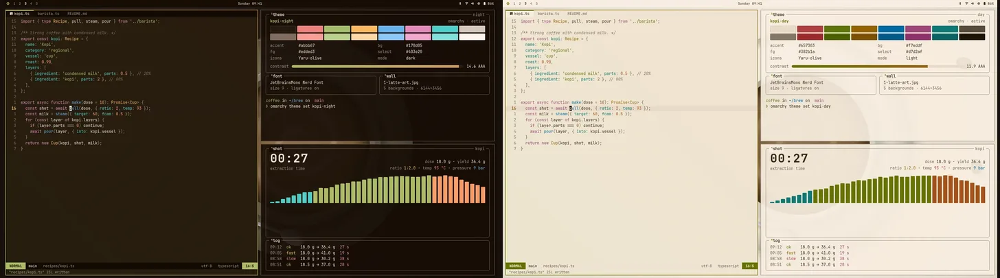](https://bjarneo.github.io/coffee-themes/#kopi)

`55` · Signature palette · Origin: Malaysia and Singapore · Folder: [`kopi/`](kopi/) · [Open on the site](https://bjarneo.github.io/coffee-themes/#kopi)

Strong coffee with condensed milk. The recipe background shows the recipe.

| Variant | Theme name | `background` | `foreground` | `accent` | Icons |
| --- | --- | --- | --- | --- | --- |
| Night | [`kopi-night`](kopi/night/) | `#170d05` | `#edded3` | `#abbb67` | `Yaru-olive` |
| Day | [`kopi-day`](kopi/day/) | `#f7eddf` | `#382b1a` | `#657303` | `Yaru-olive` |

<details>
<summary>All 16 ANSI colors of each variant</summary>

| Variant | Normal, 0 to 7 | Bright, 8 to 15 |
| --- | --- | --- |
| Night | `#271b11` `#df8071` `#96c979` `#eed780` `#cca17e` `#df9da1` `#addfbd` `#d7c7bb` | `#816d5e` `#ec9c8f` `#b2dd9c` `#ffefb1` `#ddb99c` `#efb7ba` `#caf4d7` `#fcf5f0` |
| Day | `#e9dac8` `#98392d` `#457822` `#7f6a00` `#835835` `#915157` `#437656` `#584b3a` | `#847665` `#862419` `#336505` `#6a5805` `#724721` `#803f45` `#2e6443` `#1e1407` |

</details>

```bash
curl -fsSL https://bjarneo.github.io/coffee-themes/install.sh | bash -s -- kopi --set
```

### Yuanyang

[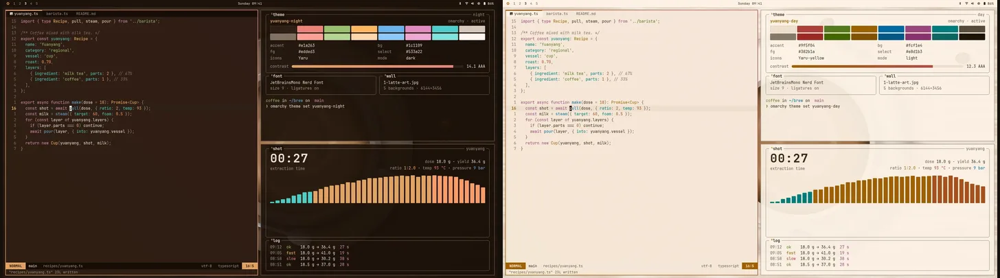](https://bjarneo.github.io/coffee-themes/#yuanyang)

`56` · Signature palette · Origin: Hong Kong · Folder: [`yuanyang/`](yuanyang/) · [Open on the site](https://bjarneo.github.io/coffee-themes/#yuanyang)

Coffee mixed with milk tea. The recipe background shows the recipe.

| Variant | Theme name | `background` | `foreground` | `accent` | Icons |
| --- | --- | --- | --- | --- | --- |
| Night | [`yuanyang-night`](yuanyang/night/) | `#1c1109` | `#edded3` | `#e1a263` | `Yaru` |
| Day | [`yuanyang-day`](yuanyang/day/) | `#fcf1e4` | `#382b1a` | `#9f5f04` | `Yaru-yellow` |

<details>
<summary>All 16 ANSI colors of each variant</summary>

| Variant | Normal, 0 to 7 | Bright, 8 to 15 |
| --- | --- | --- |
| Night | `#2c2016` `#df8071` `#b5be82` `#fbc77c` `#cea081` `#eaa6aa` `#a6d6d2` `#d7c7bb` | `#826f5f` `#ec9c8f` `#ccd3a2` `#fee3c0` `#dfb89e` `#f9c0c3` `#c4ebe8` `#fcf5f0` |
| Day | `#eddecc` `#98392d` `#687031` `#976505` `#855738` `#75373e` `#457673` `#584b3b` | `#867867` `#862419` `#585f1b` `#7c5306` `#744625` `#64262e` `#306460` `#1e1407` |

</details>

```bash
curl -fsSL https://bjarneo.github.io/coffee-themes/install.sh | bash -s -- yuanyang --set
```

### Galão

[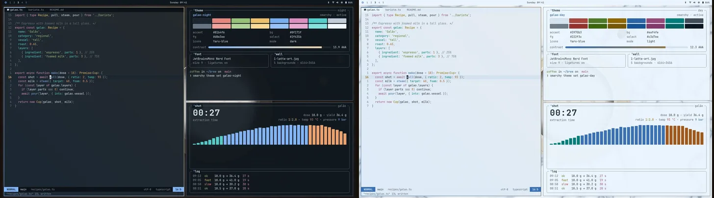](https://bjarneo.github.io/coffee-themes/#galao)

`57` · Signature palette · Origin: Portugal · Folder: [`galao/`](galao/) · [Open on the site](https://bjarneo.github.io/coffee-themes/#galao)

Espresso with foamed milk in a tall glass. The recipe background shows the recipe.

| Variant | Theme name | `background` | `foreground` | `accent` | Icons |
| --- | --- | --- | --- | --- | --- |
| Night | [`galao-night`](galao/night/) | `#0f171f` | `#d8e3ee` | `#81b4f6` | `Yaru-blue` |
| Day | [`galao-day`](galao/day/) | `#eaf4fe` | `#222f3c` | `#3970b3` | `Yaru-blue` |

<details>
<summary>All 16 ANSI colors of each variant</summary>

| Variant | Normal, 0 to 7 | Bright, 8 to 15 |
| --- | --- | --- |
| Night | `#1d2630` `#e6857e` `#82c8b0` `#f7dba1` `#6fa7ee` `#8ec5ec` `#8cdffb` `#c0ccd9` | `#667584` `#f3a29a` `#a3dcc7` `#feedc9` `#8fbdf9` `#addbfb` `#c9effd` `#f2f7fd` |
| Day | `#d5e2f0` `#9c3c38` `#2a7a62` `#866b2d` `#2460a7` `#39749b` `#00667e` `#424e5c` | `#6e7c8a` `#8a2727` `#046750` `#725711` `#094e96` `#226188` `#015468` `#0d1721` |

</details>

```bash
curl -fsSL https://bjarneo.github.io/coffee-themes/install.sh | bash -s -- galao --set
```

### Wiener Melange

[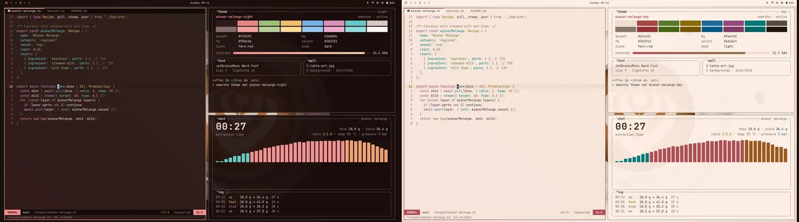](https://bjarneo.github.io/coffee-themes/#wiener-melange)

`58` · Signature palette · Origin: Austria · Folder: [`wiener-melange/`](wiener-melange/) · [Open on the site](https://bjarneo.github.io/coffee-themes/#wiener-melange)

Espresso with steamed milk and foam. The recipe background shows the recipe.

| Variant | Theme name | `background` | `foreground` | `accent` | Icons |
| --- | --- | --- | --- | --- | --- |
| Night | [`wiener-melange-night`](wiener-melange/night/) | `#1b0d0c` | `#f0dcda` | `#f49191` | `Yaru-red` |
| Day | [`wiener-melange-day`](wiener-melange/day/) | `#feefe5` | `#3b291d` | `#b14c51` | `Yaru-red` |

<details>
<summary>All 16 ANSI colors of each variant</summary>

| Variant | Normal, 0 to 7 | Bright, 8 to 15 |
| --- | --- | --- |
| Night | `#2c1c1a` `#da6b6e` `#98c5a0` `#f2cc7a` `#dd939e` `#eba6c6` `#ecdcc1` `#dac5c3` | `#856a68` `#e78989` `#b4d9bb` `#fee5b3` `#ecaeb6` `#fbc1db` `#faedd6` `#fef4f3` |
| Day | `#f1dcce` `#982431` `#497653` `#8c6908` `#914a56` `#7b3b5c` `#7b6b51` `#5b493d` | `#897669` `#86011f` `#366541` `#735609` `#803746` `#6a294b` `#68593e` `#201309` |

</details>

```bash
curl -fsSL https://bjarneo.github.io/coffee-themes/install.sh | bash -s -- wiener-melange --set
```

### Einspänner

[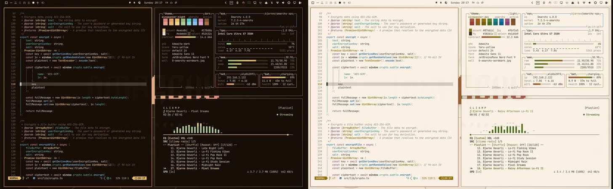](https://bjarneo.github.io/coffee-themes/#einspanner)

`59` · Origin: Austria · Folder: [`einspanner/`](einspanner/) · [Open on the site](https://bjarneo.github.io/coffee-themes/#einspanner)

Espresso with a thick layer of whipped cream. The recipe background shows the recipe.

| Variant | Theme name | `background` | `foreground` | `accent` | Icons |
| --- | --- | --- | --- | --- | --- |
| Night | [`einspanner-night`](einspanner/night/) | `#170d06` | `#edded4` | `#eace8c` | `Yaru-yellow` |
| Day | [`einspanner-day`](einspanner/day/) | `#fbf1e5` | `#382b1c` | `#876b1c` | `Yaru-yellow` |

<details>
<summary>All 16 ANSI colors of each variant</summary>

| Variant | Normal, 0 to 7 | Bright, 8 to 15 |
| --- | --- | --- |
| Night | `#271b13` `#e48879` `#9abf7a` `#e9c26a` `#71b2e4` `#dc8fb9` `#60cbc9` `#d7c7bc` | `#816d60` `#f2a497` `#b4d39b` `#fada94` `#93c7f1` `#ebaacd` `#8cdfdc` `#fcf5f1` |
| Day | `#eddecd` `#a5483b` `#547830` `#8c6a04` `#1d699b` `#974b77` `#137b7a` `#584a3c` | `#867868` `#933428` `#416516` `#735705` `#015888` `#853867` `#0f6665` `#1e1408` |

</details>

```bash
curl -fsSL https://bjarneo.github.io/coffee-themes/install.sh | bash -s -- einspanner --set
```

### Pharisäer

[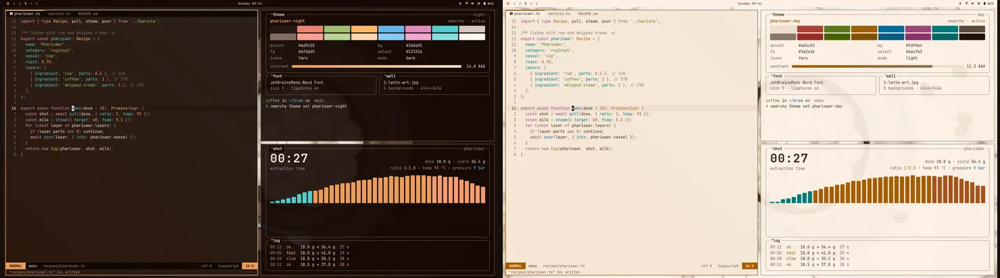](https://bjarneo.github.io/coffee-themes/#pharisaer)

`60` · Origin: Germany · Folder: [`pharisaer/`](pharisaer/) · [Open on the site](https://bjarneo.github.io/coffee-themes/#pharisaer)

Coffee with rum and whipped cream. The recipe background shows the recipe.

| Variant | Theme name | `background` | `foreground` | `accent` | Icons |
| --- | --- | --- | --- | --- | --- |
| Night | [`pharisaer-night`](pharisaer/night/) | `#160a05` | `#efddd5` | `#ed9c55` | `Yaru` |
| Day | [`pharisaer-day`](pharisaer/day/) | `#fdf0e4` | `#3a2a1b` | `#a65c03` | `Yaru` |

<details>
<summary>All 16 ANSI colors of each variant</summary>

| Variant | Normal, 0 to 7 | Bright, 8 to 15 |
| --- | --- | --- |
| Night | `#261811` `#ec8274` `#9ebe6d` `#ffb668` `#61b5e8` `#e18bbc` `#4fcdcd` `#d9c6be` | `#836c61` `#f8a092` `#b7d390` `#fed6ae` `#88caf5` `#f0a7d0` `#82e0df` `#fdf5f1` |
| Day | `#efddcd` `#ac4135` `#59781a` `#9d600a` `#036b99` `#9b457a` `#037a7a` `#594a3b` | `#887767` `#9a2b22` `#486403` `#854f00` `#095980` `#893169` `#006565` `#1f1308` |

</details>

```bash
curl -fsSL https://bjarneo.github.io/coffee-themes/install.sh | bash -s -- pharisaer --set
```

### Kaffeost

[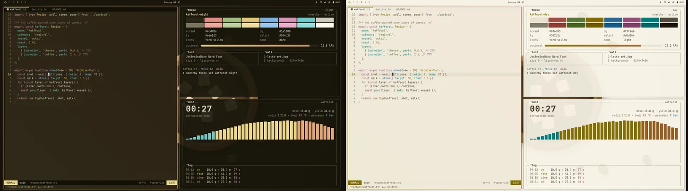](https://bjarneo.github.io/coffee-themes/#kaffeost)

`61` · Origin: Finland and Sweden · Folder: [`kaffeost/`](kaffeost/) · [Open on the site](https://bjarneo.github.io/coffee-themes/#kaffeost)

Hot coffee poured over cubes of cheese. The recipe background shows the recipe.

| Variant | Theme name | `background` | `foreground` | `accent` | Icons |
| --- | --- | --- | --- | --- | --- |
| Night | [`kaffeost-night`](kaffeost/night/) | `#1a160b` | `#e6e1d3` | `#ecd78a` | `Yaru-yellow` |
| Day | [`kaffeost-day`](kaffeost/day/) | `#f7f2e6` | `#342d1c` | `#836d03` | `Yaru-yellow` |

<details>
<summary>All 16 ANSI colors of each variant</summary>

| Variant | Normal, 0 to 7 | Bright, 8 to 15 |
| --- | --- | --- |
| Night | `#292519` `#dc8c80` `#9ebd80` `#dec679` `#7bb1df` `#d693b9` `#6ec9c7` `#d0cabb` | `#7a735f` `#eaa79c` `#b7d29f` `#f1dd9f` `#9ac6ed` `#e6aecd` `#94dddb` `#f9f7ef` |
| Day | `#e7e0ce` `#9e4e44` `#587738` `#856c08` `#2e6896` `#914f77` `#037c7b` `#534c3c` | `#817a68` `#8c3b32` `#466421` `#6e5800` `#175785` `#803d65` `#016665` `#1b1508` |

</details>

```bash
curl -fsSL https://bjarneo.github.io/coffee-themes/install.sh | bash -s -- kaffeost --set
```

### Qahwa

[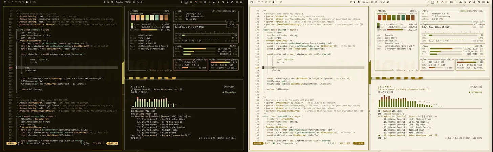](https://bjarneo.github.io/coffee-themes/#qahwa)

`62` · Signature palette · Origin: Arabian Peninsula · Folder: [`qahwa/`](qahwa/) · [Open on the site](https://bjarneo.github.io/coffee-themes/#qahwa)

Light-roast coffee with cardamom. The recipe background shows the recipe.

| Variant | Theme name | `background` | `foreground` | `accent` | Icons |
| --- | --- | --- | --- | --- | --- |
| Night | [`qahwa-night`](qahwa/night/) | `#161105` | `#e8e0d1` | `#a9bb71` | `Yaru-olive` |
| Day | [`qahwa-day`](qahwa/day/) | `#f9f2e3` | `#362d19` | `#657621` | `Yaru-olive` |

<details>
<summary>All 16 ANSI colors of each variant</summary>

| Variant | Normal, 0 to 7 | Bright, 8 to 15 |
| --- | --- | --- |
| Night | `#262012` `#de826a` `#adca7a` `#f8ca65` `#85b18e` `#dca476` `#e7e0b2` `#d2cab9` | `#7b705b` `#ec9e8a` `#c6df9d` `#fee5b1` `#a1c5a7` `#ecbd97` `#f6f0ca` `#faf6ef` |
| Day | `#e9dfcb` `#973b24` `#5c771d` `#8d6902` `#3f6c49` `#7c4711` `#6e6639` `#554c3a` | `#837966` `#85260d` `#4a6400` `#745603` `#2c5b38` `#683802` `#5d5526` `#1c1507` |

</details>

```bash
curl -fsSL https://bjarneo.github.io/coffee-themes/install.sh | bash -s -- qahwa --set
```

### Bicerin

[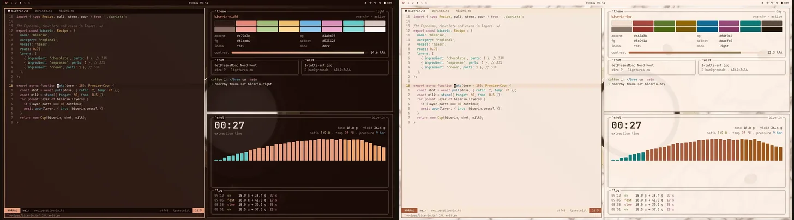](https://bjarneo.github.io/coffee-themes/#bicerin)

`63` · Signature palette · Origin: Italy · Folder: [`bicerin/`](bicerin/) · [Open on the site](https://bjarneo.github.io/coffee-themes/#bicerin)

Espresso, chocolate and cream in layers. The recipe background shows the recipe.

| Variant | Theme name | `background` | `foreground` | `accent` | Icons |
| --- | --- | --- | --- | --- | --- |
| Night | [`bicerin-night`](bicerin/night/) | `#1a0b07` | `#f1dcd6` | `#e79c7e` | `Yaru` |
| Day | [`bicerin-day`](bicerin/day/) | `#fdf0e6` | `#3c291a` | `#a65a3b` | `Yaru` |

<details>
<summary>All 16 ANSI colors of each variant</summary>

| Variant | Normal, 0 to 7 | Bright, 8 to 15 |
| --- | --- | --- |
| Night | `#2b1913` `#df7f78` `#b2be93` `#f7d293` `#d5a08d` `#eeabba` `#b3d9db` `#dbc5be` | `#866a62` `#ec9b94` `#c9d3b0` `#feecce` `#e6b9a9` `#fec6d1` `#cfeff0` `#fdf5f2` |
| Day | `#f2dcca` `#983835` `#657044` `#8c6721` `#84513e` `#945463` `#4e7476` `#5b493a` | `#8a7666` `#862323` `#545f32` `#785506` `#733f2d` `#824252` `#3a6264` `#201307` |

</details>

```bash
curl -fsSL https://bjarneo.github.io/coffee-themes/install.sh | bash -s -- bicerin --set
```

## Flavored drinks

### Caramel Macchiato

[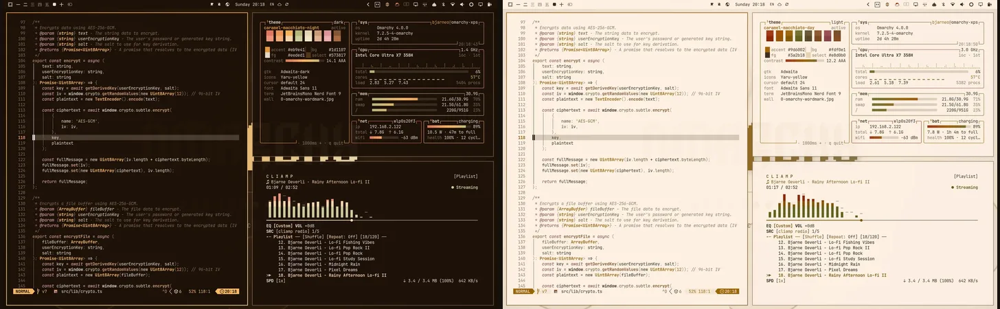](https://bjarneo.github.io/coffee-themes/#caramel-macchiato)

`64` · Signature palette · Folder: [`caramel-macchiato/`](caramel-macchiato/) · [Open on the site](https://bjarneo.github.io/coffee-themes/#caramel-macchiato)

Vanilla, milk, espresso and a caramel drizzle. The recipe background shows the recipe.

| Variant | Theme name | `background` | `foreground` | `accent` | Icons |
| --- | --- | --- | --- | --- | --- |
| Night | [`caramel-macchiato-night`](caramel-macchiato/night/) | `#1d1107` | `#eeded1` | `#eb9e41` | `Yaru-yellow` |
| Day | [`caramel-macchiato-day`](caramel-macchiato/day/) | `#fdf0e1` | `#3a2b18` | `#9d6002` | `Yaru-yellow` |

<details>
<summary>All 16 ANSI colors of each variant</summary>

| Variant | Normal, 0 to 7 | Bright, 8 to 15 |
| --- | --- | --- |
| Night | `#2e1f13` `#e77b60` `#babc80` `#ffbc64` `#d39e7a` `#e49a9f` `#ecddb9` `#d8c7ba` | `#846e5d` `#f39982` `#cfd2a0` `#ffdbaf` `#e3b799` `#f4b4b8` `#faeed0` `#fcf5f0` |
| Day | `#efddc8` `#a03114` `#6d6e2e` `#996302` `#895530` `#964d54` `#625431` `#594a38` | `#877764` `#8a1f00` `#5c5d17` `#7f5100` `#78441b` `#843b43` `#524320` `#1e1406` |

</details>

```bash
curl -fsSL https://bjarneo.github.io/coffee-themes/install.sh | bash -s -- caramel-macchiato --set
```

### Vanilla Latte

[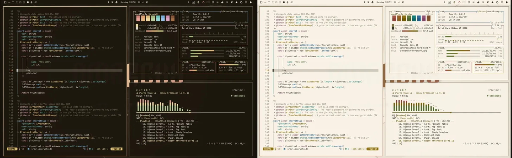](https://bjarneo.github.io/coffee-themes/#vanilla-latte)

`65` · Folder: [`vanilla-latte/`](vanilla-latte/) · [Open on the site](https://bjarneo.github.io/coffee-themes/#vanilla-latte)

A latte with vanilla syrup. The recipe background shows the recipe.

| Variant | Theme name | `background` | `foreground` | `accent` | Icons |
| --- | --- | --- | --- | --- | --- |
| Night | [`vanilla-latte-night`](vanilla-latte/night/) | `#1d170e` | `#e8e0d3` | `#efdda9` | `Yaru-yellow` |
| Day | [`vanilla-latte-day`](vanilla-latte/day/) | `#f8f2e6` | `#352c1c` | `#7f6d37` | `Yaru-yellow` |

<details>
<summary>All 16 ANSI colors of each variant</summary>

| Variant | Normal, 0 to 7 | Bright, 8 to 15 |
| --- | --- | --- |
| Night | `#2d271b` `#dc8c7f` `#a1bc7f` `#e2c479` `#7bb1de` `#d693b8` `#6fc9c6` `#d2c9bb` | `#7e7361` `#eaa79b` `#bad19e` `#f4dc9f` `#9ac7ec` `#e6aecc` `#96ddda` `#faf6ef` |
| Day | `#e8dfce` `#9e4e42` `#5c7636` `#886a08` `#2e6895` `#924f75` `#0c7c7a` `#554c3c` | `#827968` `#8c3c30` `#496320` `#725800` `#175784` `#803d64` `#086664` `#1c1508` |

</details>

```bash
curl -fsSL https://bjarneo.github.io/coffee-themes/install.sh | bash -s -- vanilla-latte --set
```

### Hazelnut Latte

[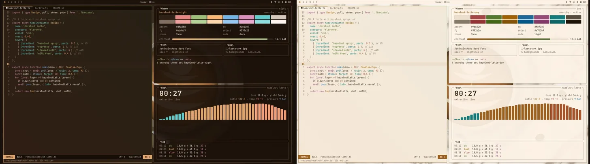](https://bjarneo.github.io/coffee-themes/#hazelnut-latte)

`66` · Folder: [`hazelnut-latte/`](hazelnut-latte/) · [Open on the site](https://bjarneo.github.io/coffee-themes/#hazelnut-latte)

A latte with hazelnut syrup. The recipe background shows the recipe.

| Variant | Theme name | `background` | `foreground` | `accent` | Icons |
| --- | --- | --- | --- | --- | --- |
| Night | [`hazelnut-latte-night`](hazelnut-latte/night/) | `#1c1109` | `#edded3` | `#dfa36d` | `Yaru` |
| Day | [`hazelnut-latte-day`](hazelnut-latte/day/) | `#fcf1e4` | `#392b1a` | `#9d6020` | `Yaru` |

<details>
<summary>All 16 ANSI colors of each variant</summary>

| Variant | Normal, 0 to 7 | Bright, 8 to 15 |
| --- | --- | --- |
| Night | `#2d2016` `#e48682` `#9bbe79` `#fab872` `#72b2e5` `#da8fbc` `#60cbcc` `#d7c7bb` | `#836e60` `#f1a29d` `#b5d299` `#fed6ad` `#94c7f2` `#eaaacf` `#8cdfdf` `#fcf5f0` |
| Day | `#eddecc` `#a54745` `#56782e` `#9f6104` `#20699b` `#964b7a` `#127b7c` `#584b3b` | `#867867` `#933333` `#436515` `#845003` `#065788` `#843869` `#0e6667` `#1e1407` |

</details>

```bash
curl -fsSL https://bjarneo.github.io/coffee-themes/install.sh | bash -s -- hazelnut-latte --set
```

### Peppermint Mocha

[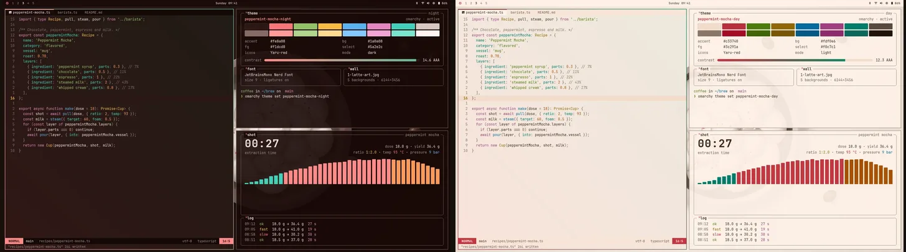](https://bjarneo.github.io/coffee-themes/#peppermint-mocha)

`67` · Signature palette · Folder: [`peppermint-mocha/`](peppermint-mocha/) · [Open on the site](https://bjarneo.github.io/coffee-themes/#peppermint-mocha)

Chocolate, peppermint, espresso and milk. The recipe background shows the recipe.

| Variant | Theme name | `background` | `foreground` | `accent` | Icons |
| --- | --- | --- | --- | --- | --- |
| Night | [`peppermint-mocha-night`](peppermint-mocha/night/) | `#1a0a08` | `#f1dcd8` | `#fe8a88` | `Yaru-red` |
| Day | [`peppermint-mocha-day`](peppermint-mocha/day/) | `#fdf0e6` | `#3c291a` | `#c33740` | `Yaru-red` |

<details>
<summary>All 16 ANSI colors of each variant</summary>

| Variant | Normal, 0 to 7 | Bright, 8 to 15 |
| --- | --- | --- |
| Night | `#2b1815` `#e85f61` `#6bcf9d` `#f7dba1` `#5eb7a7` `#f496bb` `#ace7cc` `#dcc5c0` | `#866a64` `#f38180` `#93e2b8` `#feedc9` `#84cabc` `#fdb6d1` `#ccfbe5` `#fdf4f3` |
| Day | `#f3dbcb` `#a40021` `#0e7e53` `#866b2d` `#046659` `#a1456e` `#074e37` `#5c493b` | `#8b7667` `#88001a` `#006943` `#725711` `#045348` `#8f315d` `#003d29` `#201208` |

</details>

```bash
curl -fsSL https://bjarneo.github.io/coffee-themes/install.sh | bash -s -- peppermint-mocha --set
```

### Pumpkin Spice Latte

[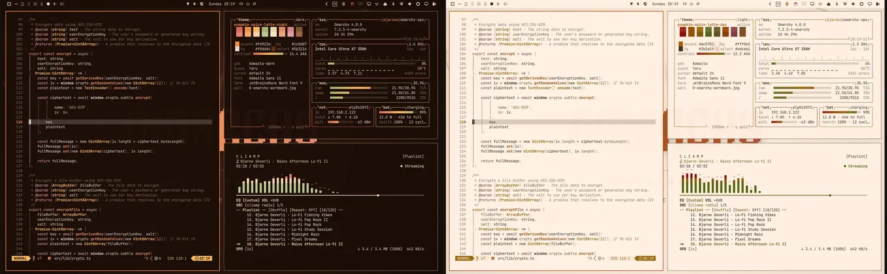](https://bjarneo.github.io/coffee-themes/#pumpkin-spice-latte)

`68` · Signature palette · Folder: [`pumpkin-spice-latte/`](pumpkin-spice-latte/) · [Open on the site](https://bjarneo.github.io/coffee-themes/#pumpkin-spice-latte)

Pumpkin and spices with espresso and milk. The recipe background shows the recipe.

| Variant | Theme name | `background` | `foreground` | `accent` | Icons |
| --- | --- | --- | --- | --- | --- |
| Night | [`pumpkin-spice-latte-night`](pumpkin-spice-latte/night/) | `#1c0d07` | `#f0ddd4` | `#fd923e` | `Yaru` |
| Day | [`pumpkin-spice-latte-day`](pumpkin-spice-latte/day/) | `#fff0e2` | `#3b2a19` | `#ac5701` | `Yaru` |

<details>
<summary>All 16 ANSI colors of each variant</summary>

| Variant | Normal, 0 to 7 | Bright, 8 to 15 |
| --- | --- | --- |
| Night | `#2d1c14` `#df6a59` `#a9ba78` `#febd5c` `#e79363` `#dc8a90` `#f0dcb1` `#dac6bc` | `#856b5f` `#eb8979` `#c1cf99` `#fedbac` `#f5ae87` `#eaa5aa` `#feedca` `#fdf5f1` |
| Day | `#f1dcc9` `#9c1f14` `#606f28` `#96650a` `#9b4806` `#93434c` `#6e5b30` `#5b4939` | `#897765` `#860500` `#4f5e0e` `#7c5306` `#823b03` `#81303b` `#5e4a1d` `#1f1307` |

</details>

```bash
curl -fsSL https://bjarneo.github.io/coffee-themes/install.sh | bash -s -- pumpkin-spice-latte --set
```

### Honey Latte

[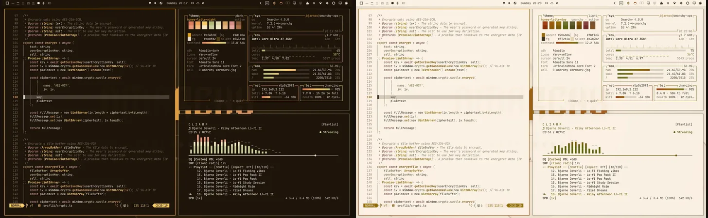](https://bjarneo.github.io/coffee-themes/#honey-latte)

`69` · Signature palette · Folder: [`honey-latte/`](honey-latte/) · [Open on the site](https://bjarneo.github.io/coffee-themes/#honey-latte)

A latte sweetened with honey. The recipe background shows the recipe.

| Variant | Theme name | `background` | `foreground` | `accent` | Icons |
| --- | --- | --- | --- | --- | --- |
| Night | [`honey-latte-night`](honey-latte/night/) | `#1d140a` | `#ebdfd2` | `#e2a520` | `Yaru-yellow` |
| Day | [`honey-latte-day`](honey-latte/day/) | `#fbf1e3` | `#372c1a` | `#906606` | `Yaru-yellow` |

<details>
<summary>All 16 ANSI colors of each variant</summary>

| Variant | Normal, 0 to 7 | Bright, 8 to 15 |
| --- | --- | --- |
| Night | `#2e2317` `#e2805e` `#b5bf7b` `#ffd16b` `#daa668` `#de958e` `#e7e0b2` `#d5c8ba` | `#80705e` `#ef9d80` `#ccd49d` `#ffedc7` `#eabf8d` `#edafa9` `#f6f0ca` `#fbf6f0` |
| Day | `#ebdecb` `#9b380e` `#687027` `#8e6900` `#825204` `#803a36` `#5d5528` `#574b3a` | `#857866` `#832a00` `#575f09` `#755600` `#6d4300` `#6e2826` `#4d4514` `#1d1407` |

</details>

```bash
curl -fsSL https://bjarneo.github.io/coffee-themes/install.sh | bash -s -- honey-latte --set
```

### Lavender Latte

[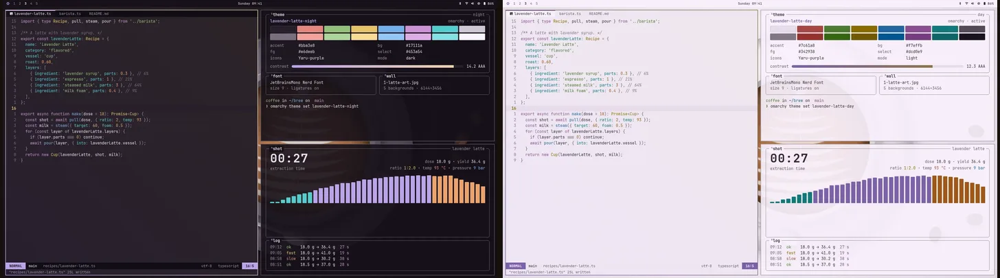](https://bjarneo.github.io/coffee-themes/#lavender-latte)

`70` · Signature palette · Folder: [`lavender-latte/`](lavender-latte/) · [Open on the site](https://bjarneo.github.io/coffee-themes/#lavender-latte)

A latte with lavender syrup. The recipe background shows the recipe.

| Variant | Theme name | `background` | `foreground` | `accent` | Icons |
| --- | --- | --- | --- | --- | --- |
| Night | [`lavender-latte-night`](lavender-latte/night/) | `#17111a` | `#e6deeb` | `#bba3e8` | `Yaru-purple` |
| Day | [`lavender-latte-day`](lavender-latte/day/) | `#f7effb` | `#342938` | `#7c61a8` | `Yaru-purple` |

<details>
<summary>All 16 ANSI colors of each variant</summary>

| Variant | Normal, 0 to 7 | Bright, 8 to 15 |
| --- | --- | --- |
| Night | `#27202a` `#df84a8` `#98c5a0` `#f0d49b` `#a4a2e8` `#d2a2e8` `#b2cbf9` `#d0c6d5` | `#7a6e7f` `#eda0be` `#b4d9bb` `#feedc9` `#bbbaf5` `#e4bcf7` `#d2e2fe` `#f9f5fc` |
| Day | `#e7dcec` `#963b63` `#497653` `#856a2d` `#5e599e` `#845399` `#566f9b` `#534958` | `#817686` `#842753` `#366541` `#735712` `#4e478d` `#734188` `#425b87` `#1a131e` |

</details>

```bash
curl -fsSL https://bjarneo.github.io/coffee-themes/install.sh | bash -s -- lavender-latte --set
```

### Dirty Chai

[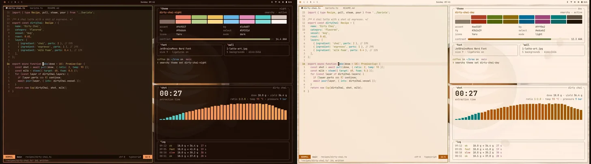](https://bjarneo.github.io/coffee-themes/#dirty-chai)

`71` · Signature palette · Folder: [`dirty-chai/`](dirty-chai/) · [Open on the site](https://bjarneo.github.io/coffee-themes/#dirty-chai)

A chai latte with a shot of espresso. The recipe background shows the recipe.

| Variant | Theme name | `background` | `foreground` | `accent` | Icons |
| --- | --- | --- | --- | --- | --- |
| Night | [`dirty-chai-night`](dirty-chai/night/) | `#1c0d07` | `#f0ddd4` | `#f69557` | `Yaru` |
| Day | [`dirty-chai-day`](dirty-chai/day/) | `#fff0e2` | `#3b2a19` | `#ae5507` | `Yaru` |

<details>
<summary>All 16 ANSI colors of each variant</summary>

| Variant | Normal, 0 to 7 | Bright, 8 to 15 |
| --- | --- | --- |
| Night | `#2d1c14` `#da6f54` `#a4bb7c` `#f4c26a` `#ce9677` `#e49a9f` `#ebddb9` `#dac6bc` | `#856b5f` `#e68d76` `#bcd09c` `#fddda6` `#deaf95` `#f4b4b8` `#f9eed0` `#fdf5f1` |
| Day | `#f1dcc9` `#97290a` `#5a702d` `#906607` `#875030` `#964d54` `#726542` `#5b4939` | `#897765` `#7e1c00` `#495f16` `#795500` `#753f1d` `#843b43` `#615430` `#1f1307` |

</details>

```bash
curl -fsSL https://bjarneo.github.io/coffee-themes/install.sh | bash -s -- dirty-chai --set
```

## Coffee beans

### Arabica

[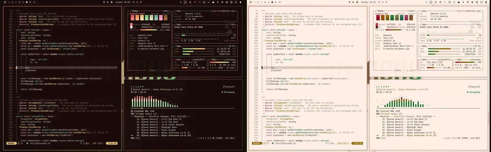](https://bjarneo.github.io/coffee-themes/#arabica)

`72` · Signature palette · Folder: [`arabica/`](arabica/) · [Open on the site](https://bjarneo.github.io/coffee-themes/#arabica)

Sweet and bright. About 60 percent of the coffee in the world. The recipe background shows a coffee cherry in cross-section.

| Variant | Theme name | `background` | `foreground` | `accent` | Icons |
| --- | --- | --- | --- | --- | --- |
| Night | [`arabica-night`](arabica/night/) | `#190b09` | `#f0dcd9` | `#fe8a88` | `Yaru-red` |
| Day | [`arabica-day`](arabica/day/) | `#feefe5` | `#3b2a1d` | `#c7303c` | `Yaru-red` |

<details>
<summary>All 16 ANSI colors of each variant</summary>

| Variant | Normal, 0 to 7 | Bright, 8 to 15 |
| --- | --- | --- |
| Night | `#291917` `#e65d64` `#7fc581` `#f2cc7a` `#7ab39a` `#ef90ae` `#c9d0a3` `#dac5c1` | `#846b66` `#f38183` `#9fd9a0` `#fee5b3` `#99c7b1` `#fdadc5` `#e0e6c1` `#fdf4f3` |
| Day | `#f0dcce` `#9c0627` `#2c7933` `#8c6908` `#306d55` `#9f4164` `#6c7245` `#5a493d` | `#897669` `#80031e` `#0f681e` `#735609` `#185c44` `#8d2d52` `#585e30` `#201309` |

</details>

```bash
curl -fsSL https://bjarneo.github.io/coffee-themes/install.sh | bash -s -- arabica --set
```

### Robusta

[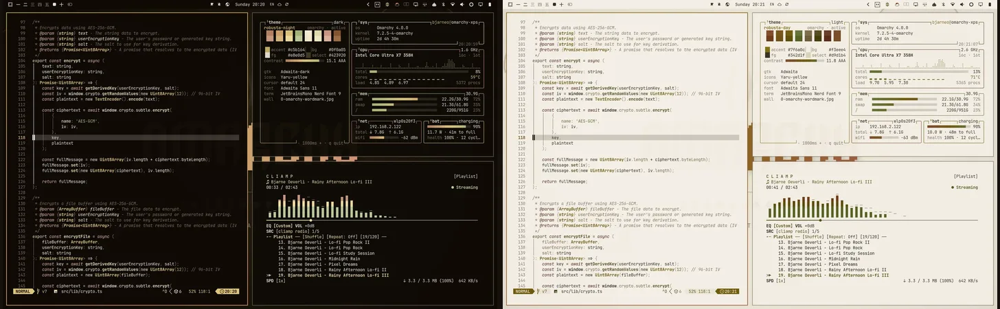](https://bjarneo.github.io/coffee-themes/#robusta)

`73` · Signature palette · Folder: [`robusta/`](robusta/) · [Open on the site](https://bjarneo.github.io/coffee-themes/#robusta)

Strong and bitter, with almost twice the caffeine of Arabica. The recipe background shows a coffee cherry in cross-section.

| Variant | Theme name | `background` | `foreground` | `accent` | Icons |
| --- | --- | --- | --- | --- | --- |
| Night | [`robusta-night`](robusta/night/) | `#0f0a05` | `#e8e0d5` | `#c5b164` | `Yaru-yellow` |
| Day | [`robusta-day`](robusta/day/) | `#f3eee4` | `#342d1f` | `#7f6a0c` | `Yaru-yellow` |

<details>
<summary>All 16 ANSI colors of each variant</summary>

| Variant | Normal, 0 to 7 | Bright, 8 to 15 |
| --- | --- | --- |
| Night | `#1e1910` `#ba8466` `#aab97f` `#e2c97d` `#e7e0b2` `#d29c8a` `#fef0d8` `#d1c9bd` | `#7a7061` `#ca9c83` `#c1ce9e` `#f5e0a3` `#f6f0ca` `#e2b5a5` `#fdecd0` `#faf6ef` |
| Day | `#e3dbce` `#7c4626` `#606e31` `#6d5807` `#4f481a` `#643422` `#7c6847` `#544c3e` | `#7e7668` `#6b3512` `#505d1c` `#5a4803` `#403804` `#542311` `#695634` `#1b150a` |

</details>

```bash
curl -fsSL https://bjarneo.github.io/coffee-themes/install.sh | bash -s -- robusta --set
```

### Liberica

[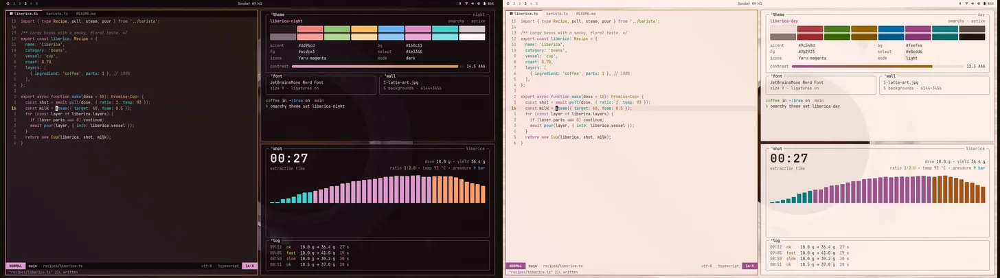](https://bjarneo.github.io/coffee-themes/#liberica)

`74` · Signature palette · Folder: [`liberica/`](liberica/) · [Open on the site](https://bjarneo.github.io/coffee-themes/#liberica)

Large beans with a smoky, floral taste. The recipe background shows a coffee cherry in cross-section.

| Variant | Theme name | `background` | `foreground` | `accent` | Icons |
| --- | --- | --- | --- | --- | --- |
| Night | [`liberica-night`](liberica/night/) | `#160c11` | `#ecdce3` | `#dd96cd` | `Yaru-magenta` |
| Day | [`liberica-day`](liberica/day/) | `#feefea` | `#3b2923` | `#9c548d` | `Yaru-magenta` |

<details>
<summary>All 16 ANSI colors of each variant</summary>

| Variant | Normal, 0 to 7 | Bright, 8 to 15 |
| --- | --- | --- |
| Night | `#261a1f` `#de7d8d` `#9dc494` `#f4ca84` `#b1a1d1` `#e79bce` `#f8d7be` `#d7c5cc` | `#806b74` `#eb9aa6` `#b7d9b0` `#fee4ba` `#c6b9e1` `#f6b7e0` `#ffeada` `#fcf4f8` |
| Day | `#f0dbd5` `#96364c` `#4e7646` `#90670e` `#6a5988` `#964c7f` `#7e5f47` `#5b4842` | `#8a756f` `#84213b` `#3c6533` `#785402` `#594877` `#84396f` `#6d4e35` `#20120e` |

</details>

```bash
curl -fsSL https://bjarneo.github.io/coffee-themes/install.sh | bash -s -- liberica --set
```

### Excelsa

[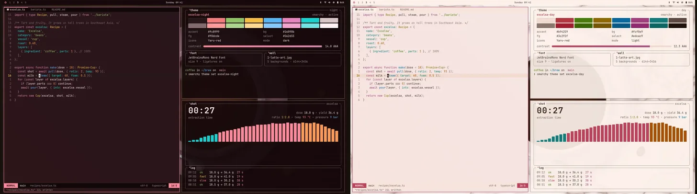](https://bjarneo.github.io/coffee-themes/#excelsa)

`75` · Signature palette · Folder: [`excelsa/`](excelsa/) · [Open on the site](https://bjarneo.github.io/coffee-themes/#excelsa)

Tart and fruity. It grows on tall trees in Southeast Asia. The recipe background shows a coffee cherry in cross-section.

| Variant | Theme name | `background` | `foreground` | `accent` | Icons |
| --- | --- | --- | --- | --- | --- |
| Night | [`excelsa-night`](excelsa/night/) | `#16090b` | `#f0dcde` | `#fc8999` | `Yaru-red` |
| Day | [`excelsa-day`](excelsa/day/) | `#fcf0e9` | `#3c291f` | `#b94259` | `Yaru-red` |

<details>
<summary>All 16 ANSI colors of each variant</summary>

| Variant | Normal, 0 to 7 | Bright, 8 to 15 |
| --- | --- | --- |
| Night | `#271719` `#de6674` `#a4c386` `#fdbc6f` `#d28bb3` `#fb93b4` `#fed2cb` `#dac4c7` | `#846a6d` `#ea868e` `#bed8a5` `#fddbb4` `#e2a6c7` `#feb7cc` `#fee9e5` `#fdf4f5` |
| Day | `#f2dbd0` `#9b1b38` `#577535` `#9a620b` `#8a446e` `#7f1945` `#92625a` `#5c483f` | `#8a756b` `#850029` `#466421` `#825100` `#78325d` `#6c0035` `#7f4f47` `#20120b` |

</details>

```bash
curl -fsSL https://bjarneo.github.io/coffee-themes/install.sh | bash -s -- excelsa --set
```

## Roast levels

### Cinnamon Roast

[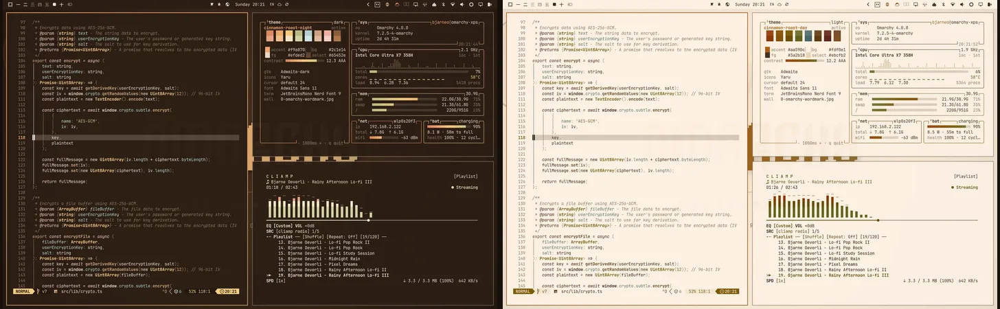](https://bjarneo.github.io/coffee-themes/#cinnamon-roast)

`76` · Signature palette · Folder: [`cinnamon-roast/`](cinnamon-roast/) · [Open on the site](https://bjarneo.github.io/coffee-themes/#cinnamon-roast)

The lightest roast. Light brown and grainy, with high acidity. The recipe background shows the roast curve.

| Variant | Theme name | `background` | `foreground` | `accent` | Icons |
| --- | --- | --- | --- | --- | --- |
| Night | [`cinnamon-roast-night`](cinnamon-roast/night/) | `#2c1e14` | `#efded2` | `#f9a870` | `Yaru` |
| Day | [`cinnamon-roast-day`](cinnamon-roast/day/) | `#fdf0e1` | `#3a2b18` | `#aa590c` | `Yaru` |

<details>
<summary>All 16 ANSI colors of each variant</summary>

| Variant | Normal, 0 to 7 | Bright, 8 to 15 |
| --- | --- | --- |
| Night | `#3e2e22` `#e28b63` `#c0c386` `#fed081` `#d3a784` `#f7b4a9` `#bbd7d9` `#d9c7ba` | `#8e7766` `#f0a685` `#d6d9a7` `#ffeccd` `#e4bfa2` `#fed2ca` `#d6edee` `#fcf5f0` |
| Day | `#efddc8` `#994211` `#717232` `#7b5703` `#6c441f` `#692e25` `#577274` `#594a38` | `#887764` `#843200` `#5d5e18` `#674700` `#5c330a` `#581d15` `#436061` `#1e1406` |

</details>

```bash
curl -fsSL https://bjarneo.github.io/coffee-themes/install.sh | bash -s -- cinnamon-roast --set
```

### Light Roast

[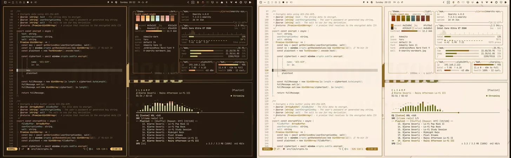](https://bjarneo.github.io/coffee-themes/#light-roast)

`77` · Signature palette · Folder: [`light-roast/`](light-roast/) · [Open on the site](https://bjarneo.github.io/coffee-themes/#light-roast)

Light brown and dry, with a bright, fruity taste. The recipe background shows the roast curve.

| Variant | Theme name | `background` | `foreground` | `accent` | Icons |
| --- | --- | --- | --- | --- | --- |
| Night | [`light-roast-night`](light-roast/night/) | `#261a10` | `#eeded2` | `#e3a165` | `Yaru` |
| Day | [`light-roast-day`](light-roast/day/) | `#fcf0e2` | `#392b19` | `#a15d0d` | `Yaru` |

<details>
<summary>All 16 ANSI colors of each variant</summary>

| Variant | Normal, 0 to 7 | Bright, 8 to 15 |
| --- | --- | --- |
| Night | `#38291e` `#dd8364` `#b5bf7b` `#fcc771` `#cda07f` `#eaa7a1` `#bbd7d9` `#d8c7ba` | `#897464` `#ea9f84` `#ccd49d` `#fee4bd` `#deb89d` `#fac1bc` `#d6edee` `#fcf5f0` |
| Day | `#eeddc9` `#963d1a` `#687027` `#92660b` `#845836` `#763935` `#577274` `#584a39` | `#877865` `#832b01` `#575f09` `#7a5300` `#734723` `#652725` `#436061` `#1e1406` |

</details>

```bash
curl -fsSL https://bjarneo.github.io/coffee-themes/install.sh | bash -s -- light-roast --set
```

### City Roast

[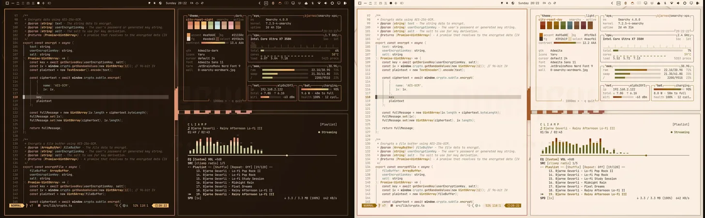](https://bjarneo.github.io/coffee-themes/#city-roast)

`78` · Signature palette · Folder: [`city-roast/`](city-roast/) · [Open on the site](https://bjarneo.github.io/coffee-themes/#city-roast)

Medium brown. The roast stops just after the first crack. The recipe background shows the roast curve.

| Variant | Theme name | `background` | `foreground` | `accent` | Icons |
| --- | --- | --- | --- | --- | --- |
| Night | [`city-roast-night`](city-roast/night/) | `#21150c` | `#eeded3` | `#ea9d60` | `Yaru` |
| Day | [`city-roast-day`](city-roast/day/) | `#fcf0e3` | `#392b19` | `#a95a00` | `Yaru` |

<details>
<summary>All 16 ANSI colors of each variant</summary>

| Variant | Normal, 0 to 7 | Bright, 8 to 15 |
| --- | --- | --- |
| Night | `#32241a` `#da7f63` `#b2bb7f` `#fcc270` `#cb9d7e` `#e6a3a0` `#b8d4d5` `#d8c7bb` | `#857060` `#e79b83` `#c9d09f` `#fedfb6` `#dcb59b` `#f6bdba` `#d3eaeb` `#fcf5f0` |
| Day | `#eeddca` `#953a1c` `#676e2f` `#956300` `#835636` `#743736` `#567273` `#584a3a` | `#877866` `#832500` `#565d19` `#7c5302` `#724523` `#632526` `#436061` `#1e1407` |

</details>

```bash
curl -fsSL https://bjarneo.github.io/coffee-themes/install.sh | bash -s -- city-roast --set
```

### Full City Roast

[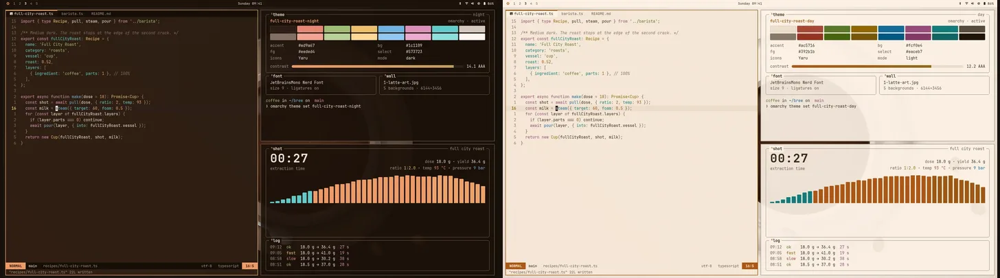](https://bjarneo.github.io/coffee-themes/#full-city-roast)

`79` · Signature palette · Folder: [`full-city-roast/`](full-city-roast/) · [Open on the site](https://bjarneo.github.io/coffee-themes/#full-city-roast)

Medium dark. The roast stops at the edge of the second crack. The recipe background shows the roast curve.

| Variant | Theme name | `background` | `foreground` | `accent` | Icons |
| --- | --- | --- | --- | --- | --- |
| Night | [`full-city-roast-night`](full-city-roast/night/) | `#1c1109` | `#eeded4` | `#ed9a67` | `Yaru` |
| Day | [`full-city-roast-day`](full-city-roast/day/) | `#fcf0e4` | `#392b1b` | `#ac5716` | `Yaru` |

<details>
<summary>All 16 ANSI colors of each variant</summary>

| Variant | Normal, 0 to 7 | Bright, 8 to 15 |
| --- | --- | --- |
| Night | `#2d1f17` `#d77b64` `#b2b77b` `#fbbd6e` `#c9997c` `#e3a09f` `#b5d1d2` `#d8c7bc` | `#836e60` `#e49783` `#c8cc9b` `#fedab0` `#dab19a` `#f3bab9` `#d0e7e8` `#fcf5f1` |
| Day | `#edddcc` `#933720` `#686b2c` `#996307` `#825336` `#733637` `#577375` `#584a3b` | `#877767` `#812207` `#575a14` `#7e5106` `#714224` `#622427` `#435f61` `#1e1407` |

</details>

```bash
curl -fsSL https://bjarneo.github.io/coffee-themes/install.sh | bash -s -- full-city-roast --set
```

### Vienna Roast

[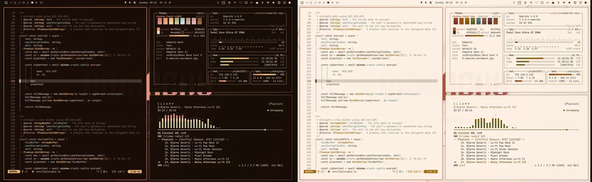](https://bjarneo.github.io/coffee-themes/#vienna-roast)

`80` · Signature palette · Folder: [`vienna-roast/`](vienna-roast/) · [Open on the site](https://bjarneo.github.io/coffee-themes/#vienna-roast)

Dark brown with spots of oil and a bittersweet taste. The recipe background shows the roast curve.

| Variant | Theme name | `background` | `foreground` | `accent` | Icons |
| --- | --- | --- | --- | --- | --- |
| Night | [`vienna-roast-night`](vienna-roast/night/) | `#180c06` | `#eeddd4` | `#ef996c` | `Yaru` |
| Day | [`vienna-roast-day`](vienna-roast/day/) | `#fcf0e4` | `#392b1b` | `#ad5520` | `Yaru` |

<details>
<summary>All 16 ANSI colors of each variant</summary>

| Variant | Normal, 0 to 7 | Bright, 8 to 15 |
| --- | --- | --- |
| Night | `#281a13` `#d07b6a` `#b0b27f` `#f5bb75` `#c19780` `#da9fa0` `#b5d1d2` `#d8c6bd` | `#836c60` `#de9687` `#c6c89d` `#ffd6a8` `#d2af9c` `#eab9b9` `#d0e7e8` `#fdf5f1` |
| Day | `#eeddcc` `#8e392a` `#676933` `#9b6100` `#7c533c` `#6c3739` `#577375` `#594a3b` | `#877767` `#7c2517` `#57581e` `#805000` `#6b422b` `#5b262a` `#435f61` `#1f1308` |

</details>

```bash
curl -fsSL https://bjarneo.github.io/coffee-themes/install.sh | bash -s -- vienna-roast --set
```

### French Roast

[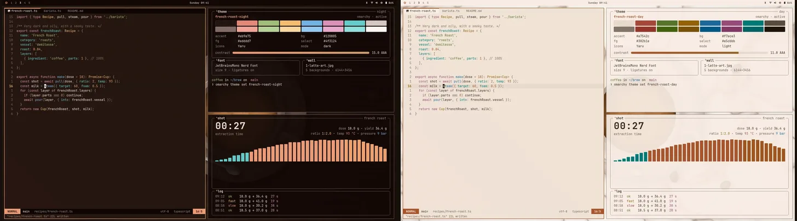](https://bjarneo.github.io/coffee-themes/#french-roast)

`81` · Signature palette · Folder: [`french-roast/`](french-roast/) · [Open on the site](https://bjarneo.github.io/coffee-themes/#french-roast)

Very dark and oily, with a smoky taste. The recipe background shows the roast curve.

| Variant | Theme name | `background` | `foreground` | `accent` | Icons |
| --- | --- | --- | --- | --- | --- |
| Night | [`french-roast-night`](french-roast/night/) | `#120805` | `#edddd7` | `#eb9a75` | `Yaru` |
| Day | [`french-roast-day`](french-roast/day/) | `#f7ece3` | `#382b1e` | `#a7542c` | `Yaru` |

<details>
<summary>All 16 ANSI colors of each variant</summary>

| Variant | Normal, 0 to 7 | Bright, 8 to 15 |
| --- | --- | --- |
| Night | `#221611` `#c87a6d` `#b0ad81` `#efb87c` `#be947e` `#d79ca0` `#b2cecf` `#d8c6bf` | `#816c63` `#d69489` `#c5c39f` `#fdd2a4` `#d0ac9a` `#e7b6b8` `#cde4e5` `#fdf5f1` |
| Day | `#e8d9cc` `#883b30` `#696538` `#976019` `#69412c` `#612d32` `#567173` `#584a3d` | `#837467` `#76281e` `#585425` `#7f4d01` `#58301b` `#501c23` `#415d5f` `#1e140a` |

</details>

```bash
curl -fsSL https://bjarneo.github.io/coffee-themes/install.sh | bash -s -- french-roast --set
```

### Italian Roast

[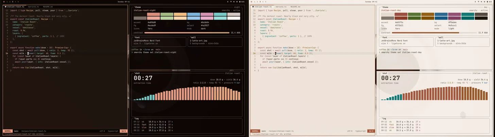](https://bjarneo.github.io/coffee-themes/#italian-roast)

`82` · Signature palette · Folder: [`italian-roast/`](italian-roast/) · [Open on the site](https://bjarneo.github.io/coffee-themes/#italian-roast)

The darkest roast. Nearly black and very oily. The recipe background shows the roast curve.

| Variant | Theme name | `background` | `foreground` | `accent` | Icons |
| --- | --- | --- | --- | --- | --- |
| Night | [`italian-roast-night`](italian-roast/night/) | `#0c0604` | `#ecded9` | `#e89b80` | `Yaru` |
| Day | [`italian-roast-day`](italian-roast/day/) | `#f5ede6` | `#372b21` | `#a5573c` | `Yaru` |

<details>
<summary>All 16 ANSI colors of each variant</summary>

| Variant | Normal, 0 to 7 | Bright, 8 to 15 |
| --- | --- | --- |
| Night | `#1b130f` `#c07a70` `#afa985` `#eab583` `#f1cab9` `#c49397` `#afcacc` `#d6c7c1` | `#7f6d67` `#cf938b` `#c4bfa1` `#facea5` `#fde5da` `#d5abaf` `#c9e0e1` `#fdf5f2` |
| Day | `#e5dad1` `#823c35` `#69623e` `#946129` `#634132` `#5a2e34` `#557173` `#564b40` | `#83766b` `#702a24` `#58522c` `#804c09` `#533121` `#4a1e25` `#415d5f` `#1d140c` |

</details>

```bash
curl -fsSL https://bjarneo.github.io/coffee-themes/install.sh | bash -s -- italian-roast --set
```


## How the themes are made

The scripts in [`tools/`](tools/) make every file in this repo. They need Node.js 22 or later, Chromium, ImageMagick and ffmpeg. `tools/capture.sh` also needs Omarchy, Hyprland and grim.

| Script | Output |
| --- | --- |
| `tools/palettes.mjs` | The drink table and the color math. Every other script reads it. |
| `tools/build.mjs` | `colors.toml` and `icons.theme` of each variant, and `site/assets/themes.js` |
| `tools/render.mjs` | The 5 backgrounds of each variant at 6K. `tools/render.html` draws them on a canvas. |
| `tools/capture.sh` | `preview.png` of each variant and the site screenshots. It applies each variant on this desktop and takes a screenshot of workspace 8. |
| `tools/assets.mjs` | The site previews, the thumbnails, the Aether copies and the mosaic |
| `tools/promo.mjs` | `site/assets/promo.mp4`. `tools/promo.html` draws the frames. |
| `tools/readme.mjs` | This README |

To build everything again, run the scripts in this order:

```bash
node tools/build.mjs
node tools/render.mjs
tools/capture.sh
node tools/assets.mjs
node tools/promo.mjs song.mp3
node tools/readme.mjs
```

`tools/capture.sh` takes about 25 minutes. It changes the theme of the desktop 164 times and shows workspace 8 the whole time. Open the windows that you want in the screenshots on workspace 8 first. If you switch to another workspace, the script stops and restores your theme. Run it again to continue where it stopped.

To change a drink, edit its row in `tools/palettes.mjs`, then run the scripts with the theme name, for example `node tools/render.mjs mocha` and `tools/capture.sh mocha`.

The site in [`site/`](site/) is a static page. The workflow in `.github/workflows/pages.yml` copies `install.sh` and every `colors.toml` into it and publishes it to GitHub Pages.
